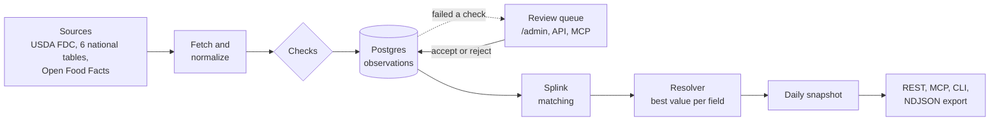

# fooddb

[](LICENSE) 

**A self-hosted food-nutrition database that merges government tables and Open Food Facts, and tells you where every number came from.** It serves one dataset as a REST API, an MCP server, a CLI and a daily snapshot export.

## Why fooddb

Food data is split across national tables. USDA, CIQUAL (France), CoFID (UK) and the others use different nutrient codes, units and licences. Crowd data from Open Food Facts (OFF) conflicts with them. An app that pays a hosted API rents the data: Edamam lets customers cache only four macro values, and FatSecret caps caching at 24 hours. An app that wires one source inherits its gaps and its errors. Instead, fooddb does the merge once, keeps the source and the licence on every value, and gives you the database to run yourself.

## What makes it different

- **Per-field provenance.** Every served value carries its `source`, its `licence` and the source `record` it came from ([`resolve.py`](src/fooddb/resolve.py)).
- **Per-field trust resolution.** The resolver picks the best value for each nutrient, not for the whole product, by freshness, agreement between sources and source rank.
- **Automatic checks and a review queue.** Energy against the Atwater macros, sugars over carbohydrate and five more checks ([`checks.py`](src/fooddb/checks.py)) hold a bad value back for a human.
- **Entity matching across sources.** [Splink](https://github.com/moj-analytical-services/splink) joins records of the same product, and a reviewer can split a wrong merge for good.
- **Licence-clean layers.** Government data stays in the core layer, and OFF data stays in its own ODbL layer, so the core is not forced under ODbL. Also, fooddb publishes the OFF layer as a monthly ODbL dump.
- **Reproducible daily snapshots.** Pin any of the last 30 days, or sync a local read-only copy from the NDJSON export. You may store what you fetch.
- **REST, MCP and CLI from one database**, in one image, in about 430 MB of RAM. The production stack of API, worker and Postgres 18 runs on one small Hetzner Cloud VM.

## How it compares

| | fooddb | Open Food Facts server [1] | OpenNutrition and mcp-opennutrition [2] | Raw USDA FDC files [3] | Nutritionix, Edamam, FatSecret [4] |
|---|---|---|---|---|---|
| Runs on your own server | Yes, Docker Compose | Yes, Docker | Yes, local dataset and local MCP | Yes, file download | No. Edamam bars saving data [5]. Nutritionix: unknown |
| Sources merged | USDA FDC and 6 national tables, plus OFF in a separate layer | One crowd-edited source | USDA, CNF, FRIDA, AUSNUT and web sources, reconciled by language models | One (USDA) | Not documented per source |
| Per-field provenance | Yes: source, licence, record | One source only | Partial: the project says "significant gaps in attribution remain" | One source only | Unknown |
| Conflict resolution across sources | Per field: approved label read, freshness, agreement, source rank | None between sources | Language models reconcile values | Not needed | Unknown |
| Quality checks and human review | Yes: 7 checks, review queue, `/admin` | Yes: data-quality checks, crowd edits [6] | Model audit, no review queue documented | No | Unknown |
| MCP server | Built in, stdio and HTTP | No official server [6] | Yes, local | No | Edamam: yes [7]. FatSecret: not mentioned. Nutritionix: unknown |
| Licence of code and data | AGPL-3.0. Data per source, OFF layer ODbL | AGPL-3.0, ODbL | MIT (MCP), ODbL (data) | CC0 [8] | Proprietary. Caching is limited [5] [9] |
| Stack | Python, FastAPI, Postgres 18 | Perl, MongoDB | Node.js | Files | Hosted |

Among the projects in this table that you can run yourself, only fooddb does all four of the following. It merges several government tables with Open Food Facts. It keeps the source and the licence on every value. It resolves conflicts per field. It ships as a database that you run yourself.

fooddb has a much smaller catalog. Production holds 41,848 products. FatSecret states more than 2.3 million food items [9], Open Food Facts states 1.7 million products [1], and mcp-opennutrition states 300,000 items [2].

Sources, checked on 2026-10-08 unless noted. `unknown` means that the vendor page did not answer the question or could not be read.

1. [Open Food Facts server](https://github.com/openfoodfacts/openfoodfacts-server): Perl and MongoDB, AGPL-3.0, Docker setup. Data under ODbL. The repository page states "1.7 million+ products from 150 countries". Overlap and treatment: [docs/landscape.md](docs/landscape.md) (checked 2026-10-04).
2. [OpenNutrition](https://www.opennutrition.app/about) (sources, language-model method, attribution gaps) and [mcp-opennutrition](https://github.com/deadletterq/mcp-opennutrition) (MIT, "runs fully locally", 300,000+ items).
3. [USDA FoodData Central downloads](https://fdc.nal.usda.gov/download-datasets/): CSV and JSON files. The CC0 licence is stated in [docs/data-licence.md](docs/data-licence.md).
4. The three hosted vendors: [Nutritionix](https://www.nutritionix.com/api), [Edamam](https://developer.edamam.com/food-database-api) and [FatSecret](https://platform.fatsecret.com/platform-api). The Nutritionix pages answered HTTP 402 to automated requests, so its cells say `unknown`.
5. [Edamam Food Database API](https://developer.edamam.com/food-database-api): "API customers can cache only the four basic macro nutrient datapoints". The terms bar any request that aims to "collect, scrape or save data".
6. [docs/landscape.md](docs/landscape.md): data-quality checks in `DataQualityFood.pm`, the Robotoff review queue, and "There is no official Open Food Facts MCP server."
7. [Edamam Food MCP](https://developer.edamam.com/mcp-edamam-food): a public MCP server for the Food Database API.
8. [docs/data-licence.md](docs/data-licence.md): USDA FDC is tagged `CC0-1.0`.
9. [FatSecret storable data](https://platform.fatsecret.com/docs/guides/storable-data): "you may not cache any user data for more than 24 hours", except 11 identifiers. The [platform page](https://platform.fatsecret.com/platform-api) states "more than 2.3 million verified food items" and offers no self-hosting.

## Architecture at a glance



A failed check does not drop a value. The value waits for review, and the API serves the last accepted value until a reviewer decides. The full diagrams are in [docs/architecture.md](docs/architecture.md).

## Quickstart: self-host

You need a Linux server with Docker Compose v2. The full runbook, with TLS, upgrade and backup, is [docs/deploy.md](docs/deploy.md).

```bash
git clone https://github.com/eait-fit/fooddb.git
cd fooddb/deploy
cp .env.example .env
sed -i "s/^FOODDB__BACKEND__POSTGRES_PASSWORD=$/FOODDB__BACKEND__POSTGRES_PASSWORD=$(openssl rand -hex 24)/" .env
sed -i "s/^FOODDB__BACKEND__SECRET_KEY=$/FOODDB__BACKEND__SECRET_KEY=$(openssl rand -hex 32)/" .env
docker compose up -d --build
until curl -sf -o /dev/null http://127.0.0.1:8000/healthz; do sleep 10; done
```

The worker fetches the sources by itself on first boot. `/healthz` turns 200 after about 70 seconds to 3 minutes. To fetch one source by hand, run `docker compose exec worker fooddb run table --source frida`.

```bash
curl "http://127.0.0.1:8000/v1/products/3017620422003?include=off"   # by barcode
curl "http://127.0.0.1:8000/v1/foods?q=hummus"                       # search by name
```

Both routes answer `{"items": [...]}`. A product, shortened (the values come from a test fixture):

```json
{
  "id": 1,
  "records": ["fdc:9", "off:04006381333931"],
  "gtin14": [{"value": "04006381333931", "source": "fdc", "licence": "CC0-1.0", "record": "fdc:9"}],
  "name": {"value": "ACME, HUMMUS CLASSIC", "source": "fdc", "licence": "CC0-1.0", "record": "fdc:9"},
  "per_100": {
    "ENERC_KCAL": {"value": 229.0, "unit": "kcal", "basis": "100g", "source": "fdc", "licence": "CC0-1.0"},
    "FIBTG": {"value": 6.0, "unit": "g", "basis": "100g", "source": "off", "licence": "ODbL-1.0"}
  },
  "attribution": []
}
```

The default self-hosted read API is public. Writes, the review queue and `/admin` need a key.

**Hosted option.** [food-api.eait.fit](https://food-api.eait.fit) runs this code. Open [/portal](https://food-api.eait.fit/portal), sign in with your email, and create a read key. A pack of 100,000 requests costs EUR 29.99, and the credits never expire.

## Use it

Each topic below has more detail in [docs/usage.md](docs/usage.md).

### REST endpoints

| Route | What it does | Scope |
|---|---|---|
| `GET /v1/foods?q=` | Search products by name. | `read` |
| `GET /v1/foods/{product_id}` | One product. | `read` |
| `GET /v1/products/{barcode}` | Products for a GTIN. | `read` |
| `GET /v1/records/{record_id}` | The product that a source record belongs to, for example `fdc:9`. | `read` |
| `GET /v1/snapshots` and `GET /v1/snapshots/{day}/export` | List the snapshot days. Export one day as NDJSON. | `read` |
| `GET /v1/dumps` and `GET /v1/dumps/{name}` | The monthly ODbL dump of the OFF layer. | none |
| `GET /v1/review` and `POST /v1/review/{id}` | Read the review queue. Accept or reject a value. | `review` |
| `POST /v1/products/{id}/split` | Undo a wrong merge. | `review` |
| `POST /v1/labels` and `GET /v1/labels/{task}` | Send a label photo. Read the state of its read. | `contribute` |
| `POST /v1/brands/uploads` | Upload brand values with a label photo. | `contribute` |
| `GET /livez` and `GET /healthz` | Liveness and data freshness. `/healthz` answers 503 when a source is stale. | none |

Add `?include=off` to get the OFF layer. Add `?snapshot=YYYY-MM-DD` to pin a day.

### Authentication

Keys look like `fdb_…`. Send one as `Authorization: Bearer fdb_…` or as `X-API-Key`. Make a key with `fooddb keys create --name NAME --scope read`. Each key has a rate limit per minute. Reads need a key only if you set `FOODDB__BACKEND__REQUIRE_KEY_FOR_READS=true`. The scopes are `read`, `contribute`, `review` and `admin`.

### MCP

The MCP server calls the same functions as REST. Its tools are `search_foods`, `get_product_by_barcode`, `get_food`, `get_record_product` and `health_report`. The review tools are `review_queue`, `decide_review` and `split_product`. The tool `read_label` works on stdio. Connect to the hosted server or your own server over HTTP:

```bash
claude mcp add --transport http fooddb "https://<your host>/mcp" --header "Authorization: Bearer fdb_…"
claude mcp add fooddb --env FOODDB__BACKEND__DATABASE_URL=postgresql://… -- uv run --directory /path/to/fooddb fooddb mcp   # stdio
```

### CLI

`fooddb` has the commands `serve`, `worker`, `migrate`, `run`, `status`, `lookup`, `export`, `dump odbl`, `match train`, `keys`, `accounts` and `mcp`. On a deployed stack, run it as `docker compose exec api fooddb status`.

### Sync a local copy

A consumer that keeps its own copy syncs from the snapshot export. It does not call the per-product routes.

1. Call `GET /v1/snapshots` and pick the newest day where `final` is `true`.
2. Call `GET /v1/snapshots/{day}/export` with `Accept-Encoding: gzip`. The answer is NDJSON with one product per line.
3. Keep the `ETag`. Send it back in `If-None-Match`, and the API answers `304` for an unchanged day.
4. Replace the local copy with the new lines in one transaction.

### Label reads, brand uploads and review

- **Label reads.** The MCP tool `read_label` reads a nutrition label photo on your machine with your own Claude or Codex subscription. A server reads photos itself through `POST /v1/labels`. Low-confidence reads wait for review.
- **Brand uploads.** A brand sends values and a photo through `POST /v1/brands/uploads` or the form at `/brands/upload`. Until a GS1 verifier exists, every value waits for review.
- **Review and admin.** Reviewers work the queue in a browser at `/admin`, with the photo next to the values. The admin also has pages for jobs, the request log and users.
- **Wrong merges.** Split the records out of a product with `POST /v1/products/{id}/split`. Matching never joins them again.

## Data and licences

Every served field carries the licence of its source. The core layer holds government data. The `off` layer holds Open Food Facts data. Without `include=off`, the API returns core data only.

| Source | Country | Licence | Layer |
|---|---|---|---|
| USDA FoodData Central (Foundation, SR Legacy) | United States | CC0-1.0 | core |
| CIQUAL (ANSES) | France | Etalab 2.0 | core |
| CoFID (Public Health England) | United Kingdom | OGL v3.0 | core |
| Matvaretabellen (Mattilsynet) | Norway | NLOD 2.0 | core |
| Frida (DTU) | Denmark | CC BY 4.0 | core |
| Standard Tables of Food Composition (MEXT) | Japan | Free use, cite the source | core |
| Food Nutrient Dataset (TFDA) | Taiwan | OGDL Taiwan 1.0 | core |
| Fineli (THL) | Finland | CC BY 4.0 | core, off on production because its site answers 403 |
| Open Food Facts daily deltas | World | ODbL 1.0 | `off` |

Production on 2026-10-08 holds 41,848 products and 336,542 nutrient values in a 351 MB database. The daily snapshot of that day has 36,594 products. Open Food Facts contributes 19,303 records through its daily deltas. The full dump of about 3 million products is an optional job (`fooddb run off-dump`). USDA Branded Foods is another optional source.

The code is AGPL-3.0, and the data has its own licences. Most core sources ask you to show an attribution. Each product lists the texts in its `attribution` field. If you use the `off` layer, the ODbL needs attribution and share-alike. See [docs/data-licence.md](docs/data-licence.md).

## Status

fooddb has run in production at food-api.eait.fit since October 2026. The eait nutrition app uses it. These parts are not done:

- The GS1 check of brand uploads has no real backend, so every brand value waits for review.
- Korea MFDS ([#37](https://github.com/eait-fit/fooddb/issues/37)) and BLS are not loaded.
- The Splink weights are set by hand until a model trains on the full data.
- eait does not send label photos to `POST /v1/labels` yet.
- Search uses `pg_trgm` only, and short CJK names match poorly.
- The legal review of how far the ODbL reaches into served answers is open.

The open items are in [docs/decisions.md](docs/decisions.md#open). The list of what is built and what is planned is in [docs/architecture.md](docs/architecture.md#planned-not-built).

## Docs

- [docs/usage.md](docs/usage.md): the response shape, authentication, MCP, label reads, brand uploads, review, and the fetcher schedules
- [docs/deploy.md](docs/deploy.md): self-hosting with Docker Compose, TLS, upgrade and backup
- [docs/architecture.md](docs/architecture.md): the parts, the deployment and the data flow as built, with diagrams
- [docs/design.md](docs/design.md): the pipeline, the data model and the sources
- [docs/decisions.md](docs/decisions.md): what is settled, and what is still open
- [docs/landscape.md](docs/landscape.md): open-source competitors, and what we build and what we reuse
- [docs/data-licence.md](docs/data-licence.md): the data licences, the ODbL attribution and its share-alike obligation

## Contributing

See [CONTRIBUTING.md](CONTRIBUTING.md) for the developer workflow. Report vulnerabilities privately: [SECURITY.md](SECURITY.md).

## Licence

The code is under [AGPL-3.0](LICENSE). The data is licensed separately: the core data under the terms of each source, and the Open Food Facts layer under ODbL. See [docs/data-licence.md](docs/data-licence.md).

## Relation to eait

[eait](https://eait.fit) is the first customer. It keeps a read-only local copy of the catalog and refreshes it from the nightly snapshot, so it keeps working when fooddb is down. Nothing in fooddb is specific to eait.
