# Architecture

This document shows how fooddb works today: its parts, its deployment, and the flow of data from
the sources to the API. The diagrams show only code that exists. The last section,
[Planned, not built](#planned-not-built), shows what [design.md](design.md) describes but the code
does not have yet.

References have the form `file:line` and point to the code at commit `2480b2f`.

## System context

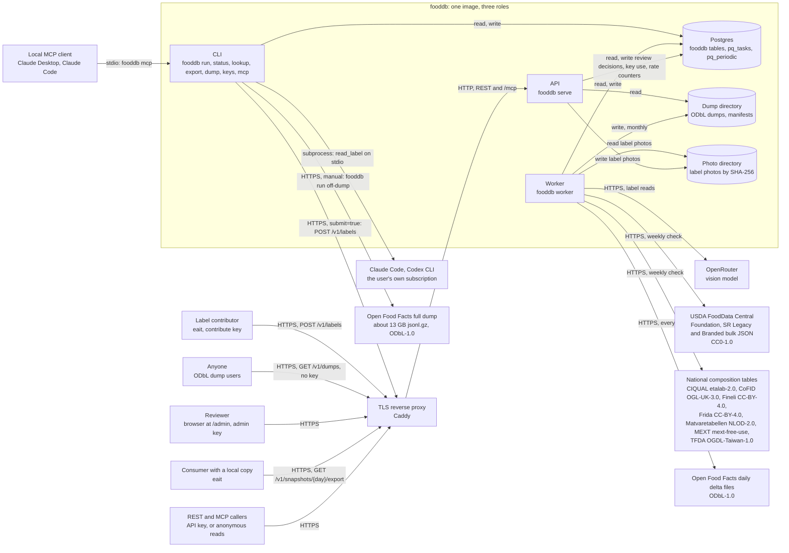
```mermaid
flowchart LR
    callers["REST and MCP callers<br/>API key, or anonymous reads"]
    consumer["Consumer with a local copy<br/>eait"]
    reviewer["Reviewer<br/>browser at /admin, admin key"]
    local["Local MCP client<br/>Claude Desktop, Claude Code"]
    anyone["Anyone<br/>ODbL dump users"]
    contributor["Label contributor<br/>eait, contribute key"]
    agents["Claude Code, Codex CLI<br/>the user's own subscription"]
    proxy["TLS reverse proxy<br/>Caddy"]
    subgraph fooddb["fooddb: one image, three roles"]
        api["API<br/>fooddb serve"]
        worker["Worker<br/>fooddb worker"]
        cli["CLI<br/>fooddb run, status, lookup, export, dump, keys, mcp"]
        db[("Postgres<br/>fooddb tables, pq_tasks, pq_periodic")]
        dumps[("Dump directory<br/>ODbL dumps, manifests")]
        photos[("Photo directory<br/>label photos by SHA-256")]
    end
    openrouter["OpenRouter<br/>vision model"]
    fdc["USDA FoodData Central<br/>Foundation, SR Legacy and Branded bulk JSON<br/>CC0-1.0"]
    tables["National composition tables<br/>CIQUAL etalab-2.0, CoFID OGL-UK-3.0, Fineli CC-BY-4.0,<br/>Frida CC-BY-4.0, Matvaretabellen NLOD-2.0, MEXT mext-free-use,<br/>TFDA OGDL-Taiwan-1.0"]
    offd["Open Food Facts daily delta files<br/>ODbL-1.0"]
    offdump["Open Food Facts full dump<br/>about 13 GB jsonl.gz, ODbL-1.0"]
    callers -->|HTTPS| proxy -->|"HTTP, REST and /mcp"| api
    consumer -->|"HTTPS, GET /v1/snapshots/{day}/export"| proxy
    reviewer -->|HTTPS| proxy
    anyone -->|"HTTPS, GET /v1/dumps, no key"| proxy
    contributor -->|"HTTPS, POST /v1/labels"| proxy
    local -->|"stdio: fooddb mcp"| cli
    api -->|"read, write review decisions, key use, rate counters"| db
    worker -->|read, write| db
    cli -->|read, write| db
    worker -->|"write, monthly"| dumps
    api -->|read| dumps
    api -->|"write label photos"| photos
    worker -->|"read label photos"| photos
    worker -->|"HTTPS, label reads"| openrouter
    cli -->|"subprocess: read_label on stdio"| agents
    cli -->|"HTTPS, submit=true: POST /v1/labels"| proxy
    worker -->|"HTTPS, weekly check"| fdc
    worker -->|"HTTPS, weekly check"| tables
    worker -->|"HTTPS, every 6 h"| offd
    cli -->|"HTTPS, manual: fooddb run off-dump"| offdump
```

fooddb has three processes, and all of them come from one image (`Dockerfile:1`):

- The **API** (`fooddb serve`, `cli.py:43`) serves REST over FastAPI. Its data writes are a
  review decision, and a label photo with its queued read (see [Label reads](#label-reads)). It also serves the MCP server over Streamable HTTP at `/mcp` (see [MCP](#mcp)),
  and the SQLAdmin review UI and admin panel at `/admin` (see [Review](#review) and
  [Admin panel](#admin-panel)). It checks API keys and rate limits on each request (see
  [Authentication](#authentication)). One middleware logs each request (see [Request log](#request-log)).
- The **worker** (`fooddb worker`, `cli.py:26`) runs the fetches, the match job and the snapshot.
  The queue is [pq](https://github.com/ricwo/pq), which keeps its tasks in the same Postgres
  database (`jobs.py:14`).
- The **CLI** (`cli.py`) applies migrations, runs one job in the foreground, and shows the status.
  `fooddb lookup` calls the API function in its own process, not over HTTP (`cli.py:106`).
  `fooddb mcp` runs the MCP server on stdio for a local client. `fooddb export` writes one day's
  snapshot to a file with the same code as the export endpoint (`cli.py:110`). `fooddb keys`
  creates, lists and revokes API keys (`cli.py:131`). `fooddb dump odbl` writes the ODbL dump now
  (`cli.py:155`).

The worker reads label photos through the model port: OpenRouter on a server, or a local agent
(see [Label reads](#label-reads)).

The worker fetches from nine upstream sources. Each value keeps the licence of its source:
`CC0-1.0` for FDC (`fetchers/fdc.py:66`), `etalab-2.0` for CIQUAL (`fetchers/ciqual.py:16`),
`OGL-UK-3.0` for CoFID (`fetchers/cofid.py:16`), `CC-BY-4.0` for Fineli (`fetchers/fineli.py:18`) and Frida (`fetchers/frida.py:16`), `NLOD-2.0` for
Matvaretabellen (`fetchers/matvaretabellen.py:12`), `mext-free-use` for MEXT (`fetchers/mext.py:19`), `OGDL-Taiwan-1.0` for TFDA (`fetchers/tfda.py:18`) and
`ODbL-1.0` for Open Food Facts (`fetchers/off.py:23`).
FDC Branded Foods and Fineli are off by default (`health.py:28`). See [Fetch](#fetch).
The worker never fetches the full OFF dump on a schedule. An operator starts it by hand
(`jobs.py:75`, [deploy.md](deploy.md#load-the-full-open-food-facts-dump)).

A consumer that keeps a local copy, such as eait, reads the snapshot export. See
[`GET /v1/snapshots/{day}/export`](#get-v1snapshotsdayexport). The eait job that loads the export
is not built. See [Planned, not built](#planned-not-built).

## Deployment

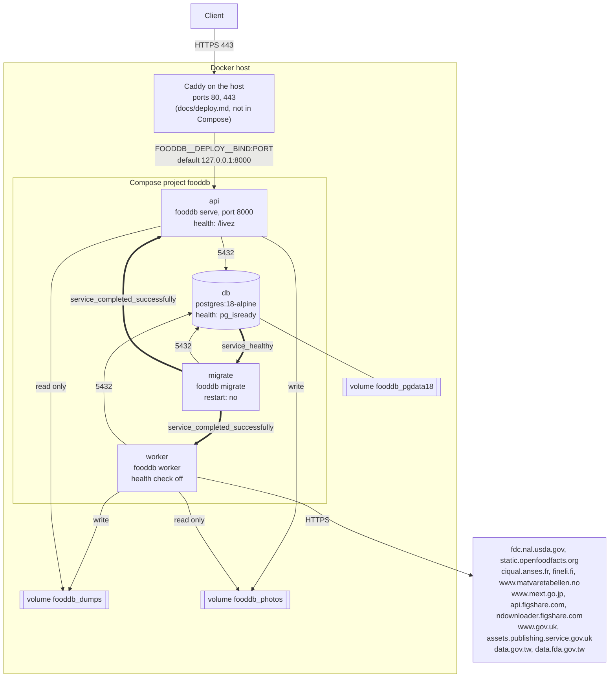
```mermaid
flowchart TB
    client["Client"]
    subgraph host["Docker host"]
        caddy["Caddy on the host<br/>ports 80, 443<br/>(docs/deploy.md, not in Compose)"]
        subgraph stack["Compose project fooddb"]
            dbc[("db<br/>postgres:18-alpine<br/>health: pg_isready")]
            mig["migrate<br/>fooddb migrate<br/>restart: no"]
            apic["api<br/>fooddb serve, port 8000<br/>health: /livez"]
            wk["worker<br/>fooddb worker<br/>health check off"]
        end
        vol[["volume fooddb_pgdata18"]]
        dvol[["volume fooddb_dumps"]]
        pvol[["volume fooddb_photos"]]
    end
    up["fdc.nal.usda.gov, static.openfoodfacts.org<br/>ciqual.anses.fr, fineli.fi, www.matvaretabellen.no<br/>www.mext.go.jp, api.figshare.com, ndownloader.figshare.com<br/>www.gov.uk, assets.publishing.service.gov.uk<br/>data.gov.tw, data.fda.gov.tw"]
    client -->|"HTTPS 443"| caddy
    caddy -->|"FOODDB__DEPLOY__BIND:PORT<br/>default 127.0.0.1:8000"| apic
    dbc --- vol
    wk -->|"write"| dvol
    apic -->|"read only"| dvol
    apic -->|"write"| pvol
    wk -->|"read only"| pvol
    mig -->|5432| dbc
    apic -->|5432| dbc
    wk -->|5432| dbc
    wk -->|HTTPS| up
    dbc ==>|service_healthy| mig
    mig ==>|service_completed_successfully| apic
    mig ==>|service_completed_successfully| wk
```

Thin arrows are network traffic. Thick arrows are the start order.

[`deploy/docker-compose.yml`](../deploy/docker-compose.yml) defines four services:

- `db` keeps its data in the `pgdata18` volume (`deploy/docker-compose.yml:21`). Compose names it
  `fooddb_pgdata18`, because the project name is `fooddb` (`deploy/docker-compose.yml:3`).
- `migrate` starts when `db` is healthy (`deploy/docker-compose.yml:33`). It applies the Alembic
  migrations, then the pq migrations, and stops (`cli.py:21`).
- `api` and `worker` start only after `migrate` stops with success
  (`deploy/docker-compose.yml:42`, `deploy/docker-compose.yml:49`). A failed migration keeps both
  of them down.
- `worker` writes the ODbL dumps to the `dumps` volume at `/app/dumps`. `api` mounts the same
  volume read-only and serves it (`deploy/docker-compose.yml:49`, `deploy/docker-compose.yml:61`).
  The image creates `/app/dumps` for the `fooddb` user, so a new volume is writable.
- `api` writes the label photos to the `photos` volume at `/app/photos`. `worker` mounts it
  read-only and reads the photos from it. The image creates `/app/photos` for the `fooddb` user.
- Compose publishes the API port on the loopback address only (`deploy/docker-compose.yml:41`).
  A TLS reverse proxy on the host forwards to it. [deploy.md](deploy.md#tls-with-caddy) shows the
  Caddy configuration.

The image health check calls `/livez` every 30 seconds (`Dockerfile:20`). The worker turns it off
(`deploy/docker-compose.yml:48`), because the worker serves no HTTP.

### The eait production variant

eait runs the same image in its own Compose file, `deploy/docker-compose.prod.yml` in the eait
repo. It serves `https://food-api.eait.fit` since 2026-10-05. The
services are `fooddb-db`, `fooddb-migrate`, `fooddb-api` and `fooddb-worker`, with the same start
order. eait's Caddy serves `food-api.eait.fit` and forwards to `fooddb-api:8000`. `fooddb-db` is
on an internal network that only fooddb uses. `fooddb-api` is also on eait's `internal` network,
where Caddy is. `fooddb-worker` also joins the `fooddb-egress` network for its fetches.

## Data flow: from ingest to the API

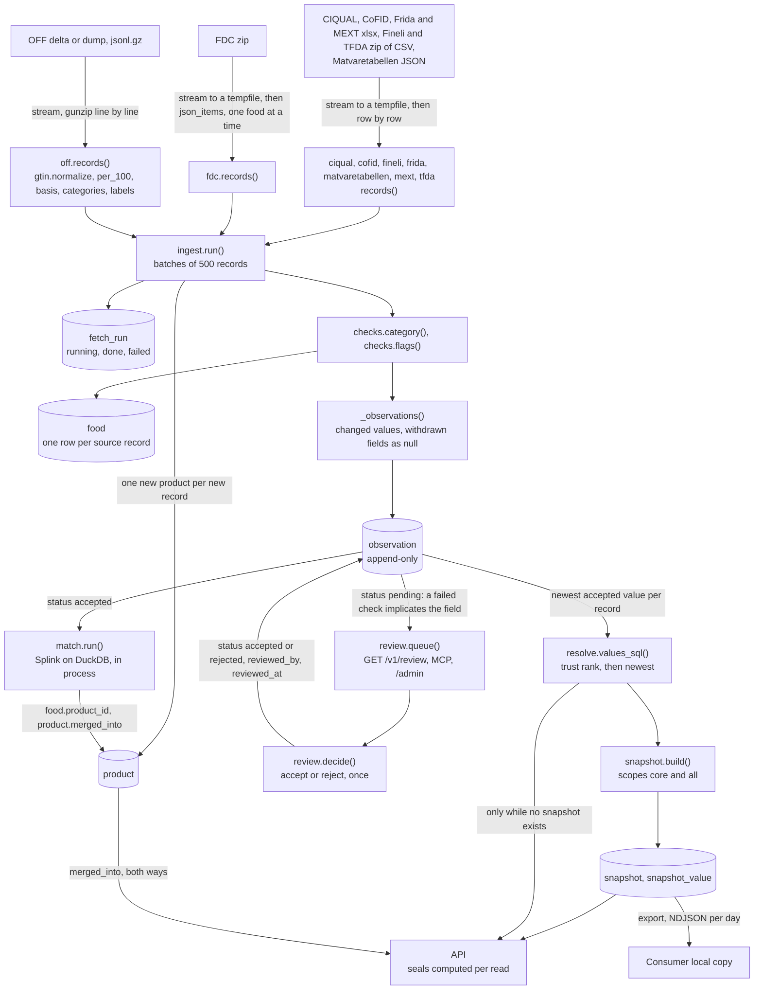
```mermaid
flowchart TD
    fdcsrc["FDC zip"] -->|"stream to a tempfile, then json_items, one food at a time"| fdcrec["fdc.records()"]
    tabsrc["CIQUAL, CoFID, Frida and MEXT xlsx, Fineli and TFDA zip of CSV,<br/>Matvaretabellen JSON"] -->|"stream to a tempfile, then row by row"| tabrec["ciqual, cofid, fineli, frida, matvaretabellen, mext, tfda<br/>records()"]
    tabrec --> run
    offsrc["OFF delta or dump, jsonl.gz"] -->|"stream, gunzip line by line"| offrec["off.records()<br/>gtin.normalize, per_100, basis, categories, labels"]
    fdcrec --> run["ingest.run()<br/>batches of 500 records"]
    offrec --> run
    run --> fr[("fetch_run<br/>running, done, failed")]
    run -->|"one new product per new record"| prod[("product")]
    run --> chk["checks.category(), checks.flags()"]
    chk --> foodt[("food<br/>one row per source record")]
    chk --> diff["_observations()<br/>changed values, withdrawn fields as null"]
    diff --> obs[("observation<br/>append-only")]
    obs -->|"status pending: a failed check implicates the field"| queue["review.queue()<br/>GET /v1/review, MCP, /admin"]
    queue --> decide["review.decide()<br/>accept or reject, once"]
    decide -->|"status accepted or rejected, reviewed_by, reviewed_at"| obs
    obs -->|"status accepted"| match["match.run()<br/>Splink on DuckDB, in process"]
    match -->|"food.product_id, product.merged_into"| prod
    obs -->|"newest accepted value per record"| resolver["resolve.values_sql()<br/>trust rank, then newest"]
    resolver --> snap["snapshot.build()<br/>scopes core and all"]
    snap --> sv[("snapshot, snapshot_value")]
    sv --> api["API<br/>seals computed per read"]
    sv -->|"export, NDJSON per day"| consumer["Consumer local copy"]
    resolver -->|"only while no snapshot exists"| api
    prod -->|"merged_into, both ways"| api
```

### Fetch

Every fetcher reads its source as a stream. `fetchers.download` writes a download to a tempfile and
returns its SHA-256 (`fetchers/__init__.py:13`). `fetchers.json_items` reads the items of one JSON
array, one at a time, so memory holds one item (`fetchers/__init__.py:25`).

- The FDC fetcher finds the newest release on the FDC download page (`fetchers/fdc.py:33`). It
  writes the zip to a tempfile and reads the JSON file in it with `json_items`
  (`fetchers/fdc.py:78`). Foundation and SR Legacy are small. Branded Foods is a zip of about
  200 MB with about 3 GB of JSON. A branded food also has its barcode (`gtinUpc`), its brand owner,
  its label serving and its `brandedFoodCategory`. Its values are per 100 ml when its serving is in
  ml (`fetchers/fdc.py:49`). Branded Foods is off by default: `FOODDB__BACKEND__FETCH_FDC_BRANDED`
  switches it on.
- The CIQUAL fetcher finds the newest English Excel file on the ANSES download page
  (`fetchers/ciqual.py:67`). The file name is the ref, and its date is the observation date. It
  reads the sheet as a stream with the standard library (`fetchers/xlsx.py:38`). A cell
  `traces` is 0. A cell `< x` (under the limit of quantification) and a cell `-` give no value
  (`fetchers/ciqual.py:36`). See [decisions.md](decisions.md).
- The CoFID fetcher reads the gov.uk content API for the publication page. It takes the Excel file of
  the integrated dataset, not the file of old foods (`fetchers/cofid.py:73`). The asset id in the
  address of the file is the ref, and the date of the newest change on the page is the observation
  date. The fetcher reads the sheets `1.3 Proximates` and `1.4 Inorganics` and joins them by food
  code (`fetchers/cofid.py:59`). It finds each column by its tagname in row 2 of the sheet. A cell
  `Tr` is 0. A cell `N` and a blank cell give no value (`fetchers/cofid.py:32`). CoFID gives the
  code 13-669 to two foods, so the fetcher keeps neither. See [decisions.md](decisions.md).
- The Frida fetcher asks DTU Data for the record of the dataset, `api.figshare.com/v2/articles/29500682`,
  and takes the `Dataset.xlsx` file of its newest version (`fetchers/frida.py:69`). The file name and
  its MD5 are the ref, so an unchanged version is not downloaded again. The observation date is the
  day DTU Data published the version. The sheet `Data_Table` has one row for each food and one
  column for each parameter. The fetcher reads a parameter by its ParameterID and checks its English
  name in the header row (`fetchers/frida.py:41`). Frida writes a trace as 0, so a number is always
  the value. A blank cell gives no value.
- The Fineli fetcher downloads the open data zip at `FOODDB__BACKEND__FINELI_URL` and reads its
  CSV files (`fetchers/fineli.py:35`). The URL has no release name, so the SHA-256 of the zip is
  the ref (`fetchers/fineli.py:55`). The observation date is the date of `component_value.csv` in
  the zip. fineli.fi refused automated requests with a Cloudflare challenge on 2026-10-06. Thus
  Fineli is off by default: `FOODDB__BACKEND__FETCH_FINELI` switches it on, for a host that can
  reach the zip or a mirror of it.
- The Matvaretabellen fetcher downloads the whole table from its API, `api/en/foods.json`, and
  reads it with `json_items` (`fetchers/matvaretabellen.py:47`). The API has no versions, so the
  SHA-256 of the file is the ref, and the values carry the day of the download.
- The MEXT fetcher reads the MEXT page of the 8th edition, 2023 supplement. It takes three Excel
  tables (`fetchers/mext.py:118`): the main table, the link `第2章（データ）`, the fatty acid table, the
  link `第2章第1表（データ）` after `脂肪酸成分表編`, and the carbohydrate table, the link `第2章本表（データ）`
  after `炭水化物成分表編`. The file names start with their date. The ref is the three names joined with
  `+`, and the observation date is the newest date. A page whose title no longer names this edition
  stops the run, because the attribution text names it. The sheet `表全体` of each table has a row of
  INFOODS component identifiers, and the fetcher finds each column by its identifier
  (`fetchers/mext.py:72`). A cell `Tr` or `(Tr)` is 0. A number in brackets is an estimate that the
  table prints as its value, so it is the value. A cell `-` gives no value (`fetchers/mext.py:46`). A
  name loses the class headings that lead some names, and its ideographic spaces become spaces.
  The main table has no sugars and no saturated fat, so the fetcher joins the two other tables to it
  on the food number (`fetchers/mext.py:89`). `FASAT` is the `FASAT` column of the fatty acid table.
  `SUGAR` is the sum of the carbohydrate table's glucose, fructose, galactose, sucrose, maltose, lactose
  and trehalose, each in its own mass, and a `-` adds nothing. Both tables must state g per 100 g, and
  the same number must name the same food in every table, or the run stops. A food that a table does
  not list gets no value from it. See [decisions.md](decisions.md).
- The TFDA fetcher reads the data.gov.tw record of dataset 8543 (`fetchers/tfda.py:75`) and takes its
  CSV zip (`fetchers/tfda.py:65`). The modification time of the record, in Taipei time, is the ref and
  the observation date. The CSV has one row for each food and analyte, so the fetcher folds it into
  one record for each food (`fetchers/tfda.py:38`). It maps an analyte by its name and its unit, and
  a changed unit stops the run. It skips the rows of sample means (`樣品平均值`), because they only
  average samples that the table lists. A blank amount gives no value, and the table has no trace
  marks. See [decisions.md](decisions.md).
- The OFF fetcher decompresses each `.gz` file as it arrives and yields one line at a time
  (`fetchers/off.py:189`). The file never goes to disk. A delta file and the 13 GB dump use the
  same path (`fetchers/off.py:204`).
- The delta fetcher takes every file in the OFF index that is not done yet. On the first run it
  takes only the newest file (`fetchers/off.py:210`).

### Normalise

- `gtin.normalize` stores each barcode as a GTIN-14 with a valid check digit. It rejects
  restricted-circulation and coupon prefixes: 02, 04, 05, 20–29, 98 and 99 (`gtin.py:3`). An OFF
  product without a valid global GTIN is skipped (`fetchers/off.py:171`).
- Nutrients use INFOODS tagnames: `ENERC_KCAL`, `ENERC_KJ`, `PROCNT`, `FAT`, `CHOCDF`, `CHOAVL`,
  `SUGAR`, `FASAT`, `FIBTG`, `NA` and `ALC` (alcohol). Each fetcher maps its source codes in one table
  (`fetchers/off.py:34`, `fetchers/fdc.py:27`, `fetchers/ciqual.py:22`, `fetchers/cofid.py:27`,
  `fetchers/fineli.py:24`, `fetchers/frida.py:26`, `fetchers/matvaretabellen.py:19`, `fetchers/mext.py:31`,
  `fetchers/tfda.py:31`).
- Each value keeps the code of the quantity that the source states. The code converts no value
  from one code to another, except kJ to kcal (below).
- Carbohydrate has two codes. `CHOCDF` is carbohydrate by difference, with fibre. `CHOAVL` is
  available carbohydrate, without fibre. FDC nutrient 1005 is `CHOCDF`. FDC has no available
  carbohydrate. CIQUAL `Carbohydrate`, Fineli `CHOAVL` and Matvaretabellen `Karbo` are `CHOAVL`. MEXT states both:
  its `CHOAVL` (available, by mass) is `CHOAVL`, and its `CHOCDF-` (by difference) is `CHOCDF`. Its
  `CHOAVLM` (monosaccharide equivalents) is not stored. MEXT's `SUGAR` is the sum of its separate sugars. Frida states both: its parameter 170 is `CHOCDF`
  and its parameter 172 is `CHOAVL`. CoFID states carbohydrate and sugars as monosaccharide equivalents.
  They are neither code, so fooddb does not store them. TFDA's `總碳水化合物` is `CHOCDF`, and TFDA has no
  available carbohydrate.
- OFF's `carbohydrates` is the value on the label. `carbs_code` takes its code from the product's
  `countries_tags` (`fetchers/off.py:71`):

  | Markets in `countries_tags` | Code | Flag |
  |---|---|---|
  | US or Canada only | `CHOCDF` | none |
  | EU, UK, Switzerland, Norway, Iceland, Liechtenstein, Australia or New Zealand only | `CHOAVL` | none |
  | both groups, or neither | `CHOCDF` | `carbs-regime-unknown` in `food.flags` |

  OFF's `carbohydrates-total` (fibre included) is always `CHOCDF`.
- Units are kcal and kJ for energy, mg for sodium and g for all other nutrients (`ingest.py:14`).
  `ENERC_KCAL` is the canonical energy. When a source states kJ, the fetcher also keeps the kJ value
  as `ENERC_KJ` (OFF `energy-kj`, FDC nutrient 1062, CIQUAL, CoFID, Fineli, Frida, Matvaretabellen, MEXT and TFDA). When the
  label states kJ only, the OFF fetcher converts it to kcal for `ENERC_KCAL` (`fetchers/off.py:102`).
  Fineli states kJ only, and its fetcher converts it the same way (`fetchers/fineli.py:46`).
- The match job compares carbohydrate as `CHOCDF` only (`match.py:30`). A record with `CHOAVL` has
  no carbohydrate for matching, and a missing field neither helps nor hurts a match.
- Each value records its basis, `100g` or `100ml` (`fetchers/off.py:122`). CoFID gives its
  alcoholic beverages per 100 ml (`fetchers/cofid.py:59`).
- Each record keeps the category tags of its source: OFF `categories_tags`, FDC
  `foodCategory.description` or `brandedFoodCategory`, and `<source>:<group>` for a national table
  (CIQUAL group names, CoFID group codes with their prefixes, Fineli use classes, Matvaretabellen and Frida food group ids with their parents, MEXT
  food group numbers, TFDA food group names)
  (`fetchers/off.py:176`, `fetchers/fdc.py:63`). An OFF record also keeps
  its `labels_tags`. `checks.category` maps the tags onto one fooddb category (`checks.py:135`), and
  `food.category` stores it. Tags that no row of the table names give no category.
- An OFF record keeps a reference to its front and nutrition photos, never the photos
  (`food.images`, `fetchers/off.py:137`). For each kind it takes `lang` and `rev` from
  `images.selected.<kind>.<lang>` (new shape) or `images.<kind>_<lang>` (old shape, where `rev` is a
  string), in the product's own language if it has a photo there, else the first language by name. `images`
  is `{"front": {"lang": "it", "rev": 12}, "nutrition": {...}}`. A language code that is not
  `[A-Za-z0-9_-]{1,12}`, or a `rev` that is not a number, is dropped. `{}` means that OFF has no such photo, and null
  means that nobody asked yet: a core record, or an OFF record stored before this column existed.
  `image_url` builds the address from the barcode, `kind`, `lang` and `rev` (`fetchers/off.py:153`). OFF's
  folder is the barcode with its leading zeros removed and then padded to 13 digits, split 3/3/3/rest, for
  every length (an EAN-8 is padded too): `8002330009380` is `800/233/000/9380`, and the file is
  `front_it.12.400.jpg`. See [product-images.md](product-images.md) for why only the reference is stored.
- Record ids have the form `<source>:<code>`, for example `fdc:168421`, `off:<gtin14>`,
  `ciqual:24999`, `cofid:14-319`, `fineli:1`, `frida:1`, `matvaretabellen:06.178`, `mext:07107` or `tfda:D3200301`.

### Store observations

`ingest.run` writes one `fetch_run` row per file or release (`ingest.py:79`). It marks a run that a
killed process left in `running` as `failed` (`ingest.py:84`). A run that stores no records fails
with `EmptyRun`, because that usually means the source format changed (`ingest.py:96`).

For each batch, `_write` does these steps (`ingest.py:105`):

1. It creates one `product` row for each record that it did not see before (`ingest.py:115`).
2. It maps the record's category and runs the checks on the record (`ingest.py:111`). The failed
   check names go into `food.flags`.
3. It upserts the `food` row. An older file cannot overwrite newer metadata (`ingest.py:140`). A changed
   photo reference (`images`) updates the row like any other metadata, and adds no observation.
4. It inserts observations only for values that changed, and a null value for each field that the
   source removed (`ingest.py:150`). A record seen again with the same `observed_at` is compared in the
   same way, so an unchanged field stores nothing and a dropped field stores its withdrawal. Of several
   rows with one `observed_at`, the newest `id` wins.

The `observation` table is append-only. The code never deletes an observation. The only update is
a review decision: it moves a `pending` observation to `accepted` or `rejected`, once
(`review.py:60`).

### Checks and review status

`checks.flags` runs seven checks per record (`checks.py:196`). Each failed check names the fields
that it implicates:

| Check | Implicated fields |
|---|---|
| `energy-mismatch`: Atwater energy against the macros | `ENERC_KCAL`, `PROCNT`, `FAT`, the carbohydrate code, `FIBTG` when it is used, and `ALC` when the record has it |
| `macros-over-100g`: protein, fat and carbohydrate over 100 g | the macros that the record has |
| `sugars-over-carbs` | `SUGAR`, the carbohydrate code |
| `saturates-over-fat` | `FASAT`, `FAT` |
| `negative-value` | each negative field |
| `out-of-range`: a value outside the plausible range of the record's category | each field out of range |
| `seal-disagreement`: OFF says the pack carries a warning seal that the values do not reach | the fields that the seal's rule reads |

The carbohydrate code is `CHOAVL` when the record has it, else `CHOCDF`. Atwater is
4 × protein + 9 × fat + 4 × carbohydrate. With `CHOAVL`, it adds 2 × fibre when `FIBTG` is present,
because available carbohydrate does not contain fibre. 2 kcal/g is the fibre factor of EU
Regulation 1169/2011, Annex XIV. With `CHOCDF`, fibre is already in the carbohydrate. When the
record has `ALC`, Atwater also adds 7 × alcohol, the ethanol factor of the same Annex. A wine, a
beer or a spirit then passes. Energy that the alcohol does not explain still fails.

The ranges are a table in `checks.py` (`checks.py:45`), with a source for each row where one
exists:

| Category | Basis | Field | Range per 100 g or 100 ml |
|---|---|---|---|
| `oils` | both | `FAT` | 85 to 100 g |
| `waters` | both | `ENERC_KCAL`, `SUGAR` | at most 5 kcal, at most 1 g |
| `beverages` | `100ml` only | `ENERC_KCAL` | at most 150 kcal |
| `fruits`, `vegetables`, `cereals` | both | `FAT` | at most 30 g |

The ranges are wide on purpose. A value out of range waits for review, so a row flags only a
value that no real product of the category has. A record with no category gets no range check.
Per 100 g, beverages include powders, so the beverage range applies per 100 ml only.

The category table (`checks.py:12`) has 15 categories: `alcoholic-beverages`, `waters`, `beverages`,
`oils`, `fats`, `dairy`, `vegetables`, `fruits`, `legumes`, `nuts`, `cereals`, `meat`, `fish`,
`sweets` and `snacks`. The first row with a tag of the record wins. OFF tags include every parent
category, so a narrow tag comes before its parent. Syrups, drink powders, coconut milk and cream,
meal replacements, supplements and oil sprays get no category.

`seal-disagreement` reads the seals of Chile and Mexico in OFF `labels_tags` (`checks.py:123`). It
flags a stated seal only when the values decide the seal and do not reach it. A seal that OFF does
not list says nothing, because OFF lists labels incompletely. The [seals](#front-of-pack-warning-seals)
come from the same rules as the served ones.

The checks flag values, but they do not change them.

### Front-of-pack warning seals

`checks.SEALS` (`checks.py:91`) holds the rules of three schemes. Each rule cites its regulation:

| Scheme | Seals | Limits |
|---|---|---|
| `CL`: Chile, Ley 20.606, limits since 27 June 2019 | `calories`, `sugars`, `saturated-fat`, `sodium` | over 275 kcal, 10 g, 4 g, 400 mg per 100 g; over 70 kcal, 5 g, 3 g, 100 mg per 100 ml |
| `MX`: Mexico, NOM-051 as modified in 2020, phase 3 | `calories`, `sugars`, `saturated-fat`, `sodium` | 275 kcal per 100 g, or 70 kcal or 8 kcal of sugar per 100 ml; sugars and saturated fat at 10 % of energy; sodium at 1 mg per kcal or 300 mg, 45 mg for a drink without energy |
| `PE`: Peru, Ley 30021, phase 2 since 17 September 2021 | `sugars`, `saturated-fat`, `sodium` | at least 10 g, 4 g, 400 mg per 100 g; at least 5 g, 3 g, 100 mg per 100 ml |

The schemes count added sugars, fats and sodium, and they exempt some foods. fooddb has total
values only. Thus a computed seal is an upper bound on the label.

`resolve.seals` computes the seals from the served `per_100` values on each read
(`resolve.py:110`). No seal is stored, and a seal never holds a value for review. The values are
liquid when every served value is per 100 ml. A seal whose inputs are missing is left out. The
licence of `seals` is the most restrictive licence among the values that the rules read:
`ODbL-1.0` over `CC0-1.0`, and an unknown licence over both.

A new observation of an implicated field gets the status `pending`. All other new observations of
the record get `accepted` (`ingest.py:155`). The resolver and the match job read only `accepted`
observations (`resolve.py:58`, `match.py:36`). Thus the last accepted value of a held field stays
in service. The [review loop](#review) moves each pending value out.

### Review

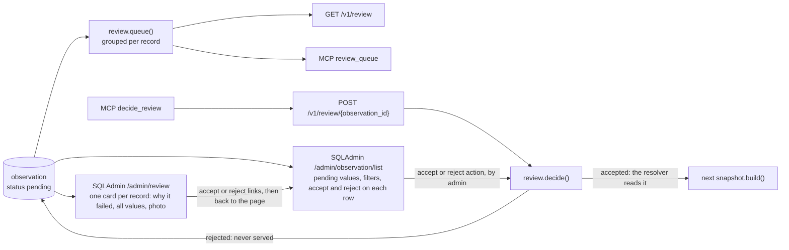
```mermaid
flowchart LR
    obs[("observation<br/>status pending")] --> q["review.queue()<br/>grouped per record"]
    q --> rest["GET /v1/review"]
    q --> mq["MCP review_queue"]
    obs --> adm["SQLAdmin /admin/observation/list<br/>pending values, filters, accept and reject on each row"]
    obs --> lab["SQLAdmin /admin/review<br/>one card per record: why it failed, all values, photo"]
    lab -->|"accept or reject links, then back to the page"| adm
    md["MCP decide_review"] --> post["POST /v1/review/{observation_id}"]
    post --> d["review.decide()"]
    adm -->|"accept or reject action, by admin"| d
    d -->|"accepted: the resolver reads it"| build["next snapshot.build()"]
    d -->|"rejected: never served"| obs
```

- `review.queue` returns the pending values grouped per source record, newest first
  (`review.py:24`). Each item has the record's failed checks (`food.flags`) and the values that the
  API serves now for its product (`resolve.products`).
- `review.decide` sets `status`, `reviewed_by`, `reviewed_at` and `review_note` in one update. The
  update matches only a `pending` row, so a value is decided once. A second decision gets a 409, and
  an unknown id gets a 404.
- An accepted value goes into the next snapshot build. It wins only if it is the newest accepted
  value of its record and field. Snapshots of earlier days do not change.
- A rejected value is never served. If the source sends the same value again, ingest sees no change
  and stores nothing, so the value does not come back for review.
- The REST routes are on one `APIRouter`, `review_router`, which needs the `review` scope
  (`api.py:110`). The split route `POST /v1/products/{id}/split` is on it too. The MCP tools `review_queue`, `decide_review` and `split_product` call the same handlers. Over
  HTTP, they need the `review` scope too (`api.py:152`). The SQLAdmin actions call `review.decide`
  with `by` set to the name of the admin key that logged in (`admin.py:106`).
- The **Review** page at `/admin/review` shows one card per food record that has pending values, of
  every source (`admin.py:199`, template `templates/review.html`).
  `review.queue(PAGE_SIZE, offset=…, check=…, source=…, detail=True)` gives the cards (`review.py:24`).
  A card has:
  - the name, brand, record id, product id and source. For an `off:` record, it links to the
    product on Open Food Facts. A leading zero of a 14-digit code is dropped, because OFF files EAN-13 codes.
  - each failed check as a badge with one line of numbers (`checks.explain`, `checks.py:239`),
    computed from the record's latest values, accepted ones too. For `energy-mismatch`, the line gives
    the Atwater energy of the macros (`checks.atwater`, `checks.py:186`, the function that the check
    itself calls), the declared `ENERC_KCAL` and `ENERC_KJ` ÷ 4.184. `sugars-over-carbs`,
    `saturates-over-fat` and `macros-over-100g` give the numbers that they compare. The other checks
    name the fields that they implicate.
  - a table of the latest value of every nutrient, whatever its status, and every pending value.
    It shows the status, the value that the API serves now for the product, and Accept and Reject
    on pending rows. Pending rows have a tinted background and settled rows are muted. **Accept all pending** sends all the pending ids of the card in one `pks` list.
  - the photo, for a label or brand record: the `evidence` of the newest pending value. The photo
    route `/admin/review/photo/{sha}` needs the admin login too.
  - the photos, for an `off:` record that has a stored reference: the front and the nutrition panel
    side by side, at 400 px, each a link to the same 400 px image in a new tab. `review.queue(detail=True)`
    adds `images: [{kind, url}]` to such an item (`review.py:52`), and the template draws them
    (`templates/review.html:45`). The `` tags are `loading="lazy"` and `referrerpolicy="no-referrer"`, so
    OFF learns neither the admin address nor the reviewer's place on the page. The browser fetches the bytes from
    `images.openfoodfacts.org`: fooddb stores and serves none, and the public API shows no reference.
    A credit line under them reads "Photo: Open Food Facts contributors, CC BY-SA 3.0" and links to the
    product page and to the licence, which is what the licence asks for. A record with no
    reference, or with `{}`, shows nothing. The admin sends no `Content-Security-Policy`, so nothing
    blocks the host. If one is added, `img-src` needs `https://images.openfoodfacts.org`.

  The query parameters `check` and `source` filter the records, and `offset` pages them by
  `PAGE_SIZE` = 25 (`admin.py:186`). The two dropdowns list the checks and sources of the records
  with pending values and their counts (`review.facets`, `review.py:99`). Each count respects the
  other filter. The filter bar stays at the top of the viewport while the cards scroll. `review.queue` without the new keyword arguments returns what it returned before,
  for `/v1/review` and the MCP tool.
- The accept and reject links of the page carry `next`, the page's own path and query. After the
  decision, the action redirects there (`admin.py:106`). `back_to` (`admin.py:116`) accepts a `next`
  only when it has no scheme or host and its normalised path is under the admin mount. Anything else
  goes to **Pending values**, as before. The Accept and Reject buttons on each row of **Pending values**
  carry the list's own path and query as `next` too, so a decision keeps the filters (`decision_buttons`, `admin.py:61`).
- The SQLAdmin actions are GET requests, as SQLAdmin builds them. The login cookie is
  `SameSite=Strict` (`admin.py:301`). Thus a link on another site does not carry the session, and
  cannot decide a value.

### Admin panel

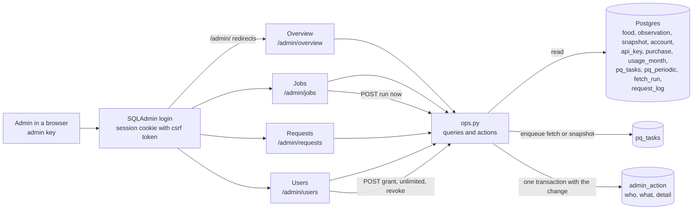
```mermaid
flowchart LR
    browser["Admin in a browser<br/>admin key"] --> login["SQLAdmin login<br/>session cookie with csrf token"]
    login -->|"/admin/ redirects"| ov["Overview<br/>/admin/overview"]
    login --> jb["Jobs<br/>/admin/jobs"]
    login --> rq["Requests<br/>/admin/requests"]
    login --> us["Users<br/>/admin/users"]
    ov --> ops["ops.py<br/>queries and actions"]
    jb --> ops
    rq --> ops
    us --> ops
    ops -->|"read"| db[("Postgres<br/>food, observation, snapshot, account,<br/>api_key, purchase, usage_month,<br/>pq_tasks, pq_periodic, fetch_run,<br/>request_log")]
    jb -->|"POST run now"| ops
    us -->|"POST grant, unlimited, revoke"| ops
    ops -->|"enqueue fetch or snapshot"| pq[("pq_tasks")]
    ops -->|"one transaction with the change"| act[("admin_action<br/>who, what, detail")]
```

- Four pages sit next to the SQLAdmin model views: **Overview**, **Jobs**, **Requests** and **Users**
  (`adminpages.py:47`). Each one is a SQLAdmin `BaseView` with a Jinja template. `ops.py` holds the
  queries and the actions, so a page function only renders. All four need the admin login, like every
  other `/admin` page. `/admin/` redirects to **Overview** (`FooddbAdmin.index`, `admin.py:287`).
- The menu has three sections, set by `category` on each view: **Review** (Review, Pending values,
  Merge log), **Platform** (Jobs, Requests) and **Customers** (Users, Accounts, Purchases).
  `templates/admin.css` lists the sections open, as headings, instead of as dropdowns.
- The look is Tabler, which SQLAdmin ships, with no JavaScript library and no build step.
  `templates/sqladmin/base.html` extends the original `base.html` (SQLAdmin registers it as
  `sqladmin_original/base.html`) and inlines `admin.css` and `admin.js`, so model views and our
  pages look alike. `sqladmin/login.html` asks only for the API key.
- Charts are inline SVG that the `columns` macro draws from the bucket counts (`admin_macros.html`).
  A bar has one `<title>` with the hour, the requests and the errors, and an hour without requests
  is an empty bar (`ops._hourly`, `ops.py:29`). A table with `data-sortable` sorts by the header
  that the admin clicks, and an `input[data-filter]` hides the rows that do not contain its text
  (`admin.js`). Both work on the rows of the page only: the server limits each list.
- **Overview** has four cards (pending values, requests of the last 24 hours, jobs, freshness), a
  chart of requests per hour, and a **Needs attention** list: the checks of the pending records,
  linked to **Review** with that check as the filter, the failed tasks and the stale fetchers. Below
  are accounts, credits outstanding, credits sold, products, the newest snapshot and ODbL dump, the
  count of source records per source and layer, and the latest 15 admin actions (`ops.py:40`). The
  count per source reads the whole `food` table, so it takes a few seconds after the full OFF dump
  is loaded.
- **Jobs** shows each watched fetcher with its last check and its state, the pq queue (pending and
  running tasks, the last 50 failed and 20 completed, with the error text and the duration), the
  pq schedules with their next run, and the last 30 `fetch_run` rows (`ops.py:72`).
- **Requests** shows the request log for 24 hours, 7 days or 30 days: requests per hour or per day,
  by status, by key, the top routes, p50 and p95 latency, the counts of 4xx, 5xx, 402 and 429, and
  the latest 50 rows (`ops.py:91`).
- **Users** is a table with one row per account: credits, the requests metered this month, its
  purchases, the grant and unlimited forms, and a **keys** disclosure with all its keys, the last use
  and the revocation time. Keys without an account are in a second list (`ops.py:110`).
- The model views have a filter panel, search, sortable columns and a page size. **Pending values**
  filters by source, nutrient and basis. The filter lists only values of pending rows
  (`PendingOnly`, `admin.py:52`), because `observation` holds every value ever read, and a `distinct`
  over it on each page load would scan it all. **Merge log** filters by kind and has a **Split**
  button on each `merge` row. **Accounts** filters by unlimited and **Purchases** by currency.
  Credits and amounts show as `1,200` and `EUR 29.99`.
- The actions are POST forms: **Run now** for a fetcher or the snapshot (`/admin/jobs/run`),
  **Grant** credits and **Set unlimited** (`/admin/users/{id}/grant` and `/unlimited`), and
  **Revoke** a key (`/admin/keys/{id}/revoke`). SQLAdmin builds its own actions as GET links, so
  these forms are our own routes. Login stores a random `csrf` value in the signed session cookie.
  Each form carries that value, and the route compares it in constant time (`adminpages.py:25`). A
  missing or wrong value gives a 403 and changes nothing. An unauthenticated request gets the login
  redirect before the route runs, and so does a session whose key was revoked.
- Each action writes one `admin_action` row in the same transaction as the change (`ops.py:126`).
  The row has the name of the admin key, the action and a JSON detail. **Overview** lists the
  latest 15.
- **Run now** queues the same function that the schedule runs. It queues nothing when a task of
  the same function and arguments is already pending or running, so a double click does not start
  two fetches. An admin cannot revoke the key of the session that he uses: the CLI does that.
- A grant is between 1 and 10,000,000 credits. Credits are never taken back here. The balance
  has a `credits >= 0` check anyway.

### Request log

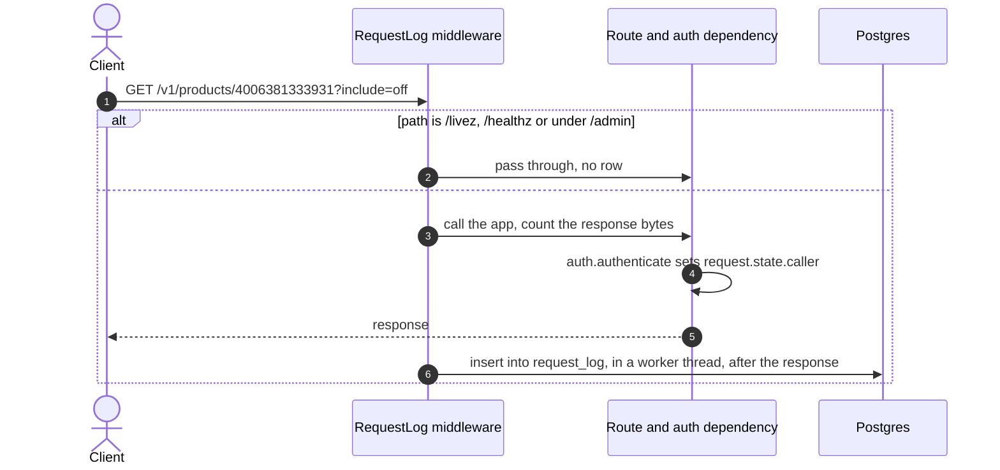
```mermaid
sequenceDiagram
    autonumber
    actor Cl as Client
    participant M as RequestLog middleware
    participant A as Route and auth dependency
    participant P as Postgres
    Cl->>M: GET /v1/products/4006381333931?include=off
    alt path is /livez, /healthz or under /admin
        M->>A: pass through, no row
    else
        M->>A: call the app, count the response bytes
        A->>A: auth.authenticate sets request.state.caller
        A-->>Cl: response
        M->>P: insert into request_log, in a worker thread, after the response
    end
```

- `RequestLog` is one ASGI middleware on the FastAPI app (`api.py:35`, `requestlog.py:61`). It
  writes one row per request from this one place. The client does not wait for the insert: it
  runs in a worker thread after the last response byte went out. A failed insert logs a warning
  and does not change the response. The insert is one statement and has no batch.
- The `route` column holds the route template, for example `/v1/products/{barcode}`. A request
  that no route matched gets `(unmatched)`. The raw URL, the query, the headers and the token are
  never read into the row. Thus barcodes, search terms and keys stay out of the log.
- `key_id`, `key_name` and `account_id` come from `request.state.caller`, which
  `auth.authenticate` sets (`auth.py:119`). A refused key (401) has no caller, so those columns
  are empty. An anonymous read has the name `anonymous`, and a RapidAPI read has the name `rapidapi`.
- The client address is stored only as `ip_hash`: the first 8 hex digits of an HMAC-SHA256 of the
  address under `FOODDB__BACKEND__SECRET_KEY` (`requestlog.py:33`). It lets an operator see that
  many requests come from one client, and it cannot be turned back into the address without the
  secret. Without the secret, nothing is stored. See the decision of 2026-10-07.
- `/livez`, `/healthz` and `/admin` are not logged. A health probe every 30 s would be most of the
  rows. The admin pages are not API requests.
- `jobs.prune_request_log` deletes the rows older than `FOODDB__BACKEND__REQUEST_LOG_DAYS`
  (default 30). The worker schedules it daily at 03:15 UTC (`jobs.py:113`).

### Label reads

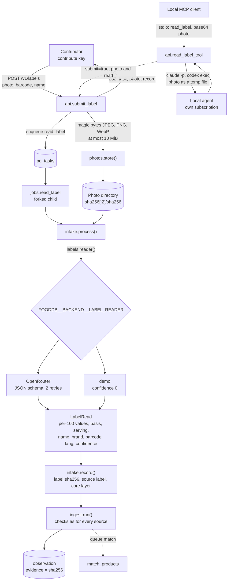
```mermaid
flowchart TD
    up["Contributor<br/>contribute key"] -->|"POST /v1/labels<br/>photo, barcode, name"| post["api.submit_label"]
    post -->|"magic bytes JPEG, PNG, WebP<br/>at most 10 MiB"| store["photos.store()"]
    store --> pdir[("Photo directory<br/>sha256[:2]/sha256")]
    post -->|"202: task, photo, record"| up
    post -->|"enqueue read_label"| q[("pq_tasks")]
    q --> job["jobs.read_label<br/>forked child"]
    job --> proc["intake.process()"]
    pdir --> proc
    proc -->|"labels.reader()"| port{"FOODDB__BACKEND__LABEL_READER"}
    port --> orr["OpenRouter<br/>JSON schema, 2 retries"]
    port --> demo["demo<br/>confidence 0"]
    orr --> read["LabelRead<br/>per-100 values, basis, serving,<br/>name, brand, barcode, lang, confidence"]
    demo --> read
    read --> rec["intake.record()<br/>label:sha256, source label, core layer"]
    rec --> ing["ingest.run()<br/>checks as for every source"]
    ing --> obs[("observation<br/>evidence = sha256")]
    ing -.->|"queue match"| match["match_products"]
    local["Local MCP client"] -->|"stdio: read_label, base64 photo"| tool["api.read_label_tool"]
    tool -->|"claude -p, codex exec<br/>photo as a temp file"| agent["Local agent<br/>own subscription"]
    agent --> tool
    tool -.->|"submit=true: photo and read"| post
```

The model port is the package `labels` (`labels/__init__.py:1`). A `LabelReader` has one method,
`read(image, mime, hints)`, which returns a `LabelRead` (`labels/__init__.py:24`). `reader()`
selects the backend by `FOODDB__BACKEND__LABEL_READER` (`labels/__init__.py:103`). The default is
`openrouter` when `FOODDB__BACKEND__LLM_API_KEY` is set, else `demo`.

| Backend | How it reads | Where it runs |
|---|---|---|
| `openrouter` | One HTTPS call with the photo as a data URL and a strict JSON schema (`labels/backends.py:23`). It retries a connection error, a 429 and a 5xx twice, and fails at once on another 4xx. The model is `FOODDB__BACKEND__LLM_MODEL`, default `qwen/qwen3-vl-235b-a22b-instruct`. | The worker on a server |
| `claude-cli` | `claude -p` with `--json-schema`, `--output-format json` and only the `Read` tool. The photo is a file in a temporary directory (`labels/backends.py:66`). | The user's machine, with `fooddb mcp` |
| `codex-cli` | `codex exec --image` with `--output-schema`, in a read-only sandbox. The last message is read from a file. | The user's machine, with `fooddb mcp` |
| `demo` | A canned read with confidence 0 (`labels/backends.py:111`). | Tests, and a server without an LLM key |

All backends answer with the same schema (`labels/__init__.py:47`). `parse` accepts one JSON
object, at most inside one code fence (`labels/__init__.py:84`). It refuses unknown nutrient codes,
values that are not finite numbers, extra fields, and a confidence outside 0 to 1. An agent CLI has
300 s, else the read fails.

The model gives each value under the code of the label's regime: `CHOAVL` for a label whose
carbohydrate excludes fibre, `CHOCDF` for a label whose carbohydrate includes it. Values are per
100 g or per 100 ml. Sodium is in mg. A label that prints only salt gives sodium as salt × 400.

The photo:

- `photos.check` reads the first bytes. Only JPEG, PNG and WebP pass (415 otherwise). The limit is
  10 MiB (413 otherwise) (`labels/photos.py:29`). The file name and the content type that the
  client sends are not used.
- `photos.store` writes the photo once, under its SHA-256, in `FOODDB__BACKEND__PHOTO_DIR`
  (`labels/photos.py:45`). A second upload of the same photo writes nothing.

The ingest (`labels/intake.py:21`):

- The record id is `label:<sha256>`, so one photo is one source record. Its source is `label`,
  its layer `core`, and its licence `LicenseRef-fooddb` (fooddb's own terms).
- Each observation has `evidence` set to the SHA-256 of the photo (`ingest.py:164`).
- The barcode that the client sends wins over the barcode that the model reads. Each must be a
  valid global GTIN.
- The checks run as for every source. A field that a failed check implicates is `pending`.
- A server read with a confidence below `FOODDB__BACKEND__LABEL_CONFIDENCE_FLOOR` (default 0.9)
  makes every value `pending`. The record gets the flag `label-low-confidence`.
- A read that the client did and sent (`read` in the form) is not read again. Every value is
  `pending`, and the record gets the flag `label-client-read`.
- `jobs.read_label` queues a match pass after the ingest (`jobs.py:71`). Thus a label record with
  the barcode of a known product joins that product.

`GET /v1/labels/{task}` returns the state of the pq task: `pending`, `running`, `completed` or
`failed`, with the error (`api.py:187`). Both label routes need the `contribute` scope.

The MCP tool `read_label` runs only on stdio (`api.py:283`). Over HTTP it answers with a tool
error. It needs no key and no database. It reads the photo with `claude-cli` by default, or with
the `reader` it is given. It returns the read. With `submit=true`, `labels.submit` posts the photo
and the read to `FOODDB__BACKEND__SUBMIT_URL` with the key `FOODDB__BACKEND__SUBMIT_KEY`
(`labels/__init__.py:117`).

### Brand uploads

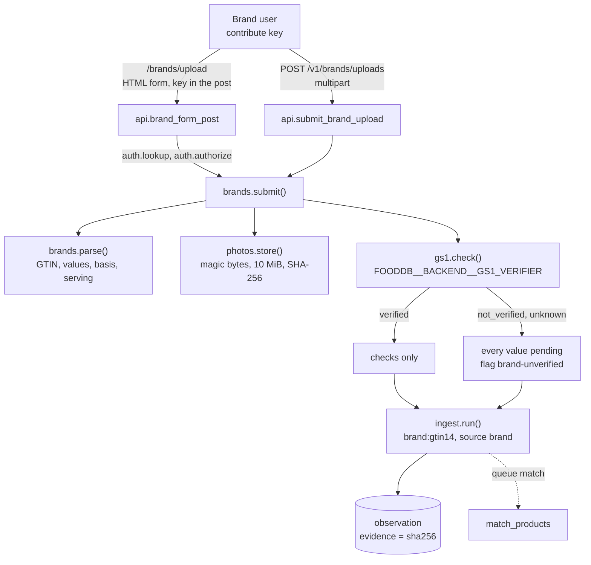
```mermaid
flowchart TD
    user["Brand user<br/>contribute key"] -->|"POST /v1/brands/uploads<br/>multipart"| api["api.submit_brand_upload"]
    user -->|"/brands/upload<br/>HTML form, key in the post"| form["api.brand_form_post"]
    form -->|"auth.lookup, auth.authorize"| sub
    api --> sub["brands.submit()"]
    sub --> parse["brands.parse()<br/>GTIN, values, basis, serving"]
    sub --> store["photos.store()<br/>magic bytes, 10 MiB, SHA-256"]
    sub --> gs1["gs1.check()<br/>FOODDB__BACKEND__GS1_VERIFIER"]
    gs1 -->|"verified"| checks["checks only"]
    gs1 -->|"not_verified, unknown"| held["every value pending<br/>flag brand-unverified"]
    checks --> ing["ingest.run()<br/>brand:gtin14, source brand"]
    held --> ing
    ing --> obs[("observation<br/>evidence = sha256")]
    ing -.->|"queue match"| match["match_products"]
```

A brand upload is the same shape as a label read with another source. The photo store, the
`evidence` column, the ingest path, the review queue and the **Review** page are the same.

- `POST /v1/brands/uploads` needs the `contribute` scope. The body is multipart: `barcode`, `name`
  and `brand` (all required), `basis` (`100g` or `100ml`, default `100g`), one field per INFOODS
  code of the label port, `serving_text`, `serving_g`, and the required `photo`. A blank field is
  absent. At least one value is required. A value must be a finite number and not negative.
  `LabelRead` validates the rest. The route answers 201 with the record id, the photo hash, the
  GS1 verdict and `review` (`required` or `checks only`).
- The barcode must be a valid global GTIN (422 otherwise). The photo gets the same checks as a
  label photo: 422 when it is missing or empty, 415 for another type, 413 above 10 MiB. The route
  stores the photo only after the other fields are valid.
- The record id is `brand:<gtin14>`: one record for each barcode. Its source is `brand`, its layer
  `core` and its licence `LicenseRef-fooddb`. The resolver ranks `brand` first.
- `gs1.py` is the verification port. A `Gs1Verifier` has one method, `verify(gtin14,
  claimed_brand)`, which answers `verified`, `not_verified` or `unknown`. `gs1.check` calls the
  verifier that `FOODDB__BACKEND__GS1_VERIFIER` names. A verifier that fails or gives another
  answer counts as `unknown`. The only backend is `none`, which always answers `unknown`: access
  to GS1 data has a cost that is still an open decision (see [decisions.md](decisions.md)).
- Only `verified` lets the checks decide. For `not_verified` and `unknown`, every value is `pending`
  and the record gets the flag `brand-unverified`. `not_verified` also gets `brand-gs1-mismatch`.
- A second upload for a barcode with a served value does not change the name, brand, language and
  serving that are served, if its verdict is not `verified`. Its values wait for review.
- The upload queues a match pass, so a brand record joins the product that has its barcode.
- `/brands/upload` is the same upload as an HTML form. The form has a password field for the key
  and no JavaScript. The server looks the key up, checks the `contribute` scope (this counts the
  rate limit) and calls `brands.submit`. It sets no cookie and keeps no session, so a cross-site
  post has no session to ride on. The response has `Cache-Control: no-store` and `Referrer-Policy:
  no-referrer`. The page never shows the key again. The key is in the body of the post, not in the
  URL, so the access log does not have it.

### Match records into products

`match.run` loads every record with its newest accepted energy and macros (`match.py:25`). Splink
compares only candidate pairs (`match.py:110`). A pair has the same GTIN, or the same name words at
a similar energy, or the same brand and first word at a similar energy. Splink returns the pairs at
or above `FOODDB__BACKEND__MATCH_THRESHOLD` (default 0.95, `match.py:23`) with their match
probability (`match.py:152`).

`merges` joins products along these pairs, the strongest pair first (`match.py:160`). The records
of one product always stay together. A pair is skipped when it would put the two records of a
`cannot_link` row in one product. Thus a cluster that contains both sides of a constraint splits at
its weakest pairs, and each side keeps the pairs that are stronger.

In each joined group, the lowest product id survives. For each other product, `match.run` moves its
`food` rows to the survivor, sets `merged_into`, and writes one `merge_log` row in the same
transaction (`match.py:195`). The row holds the two products, the records that moved, the best
probability of a pair that joined the product, and the threshold. All rows of one run have the same
`at`. Matching never splits a product. Only a reviewer splits one (see [Split](#split-a-wrong-merge)).

The m and u probabilities are set by hand in `SETTINGS`. `fooddb match train` estimates them on the
current records (`match.py:214`). It estimates u by random sampling, and m by expectation
maximisation, blocked on the GTIN and then on the name words. It saves the Splink model as JSON to
`FOODDB__BACKEND__MATCH_MODEL` or `--out`. When that file exists, `match.run` uses it instead of
`SETTINGS` (`match.py:137`). The training runs in the CLI process, never in the worker parent.

### Split a wrong merge

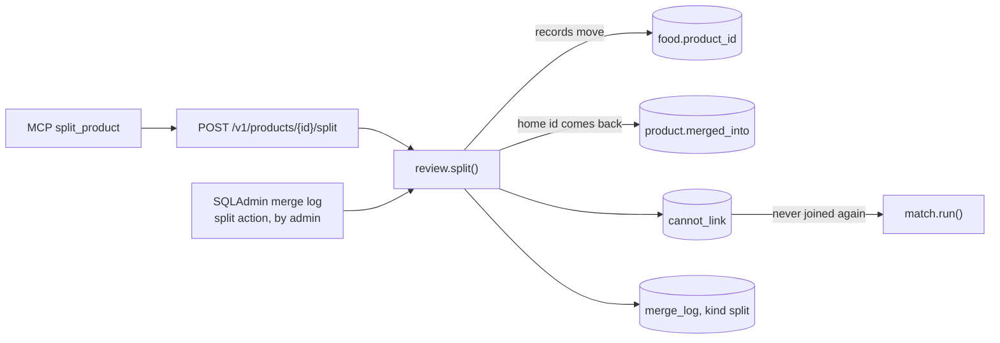
```mermaid
flowchart LR
    rest["POST /v1/products/{id}/split"] --> s["review.split()"]
    mcp["MCP split_product"] --> rest
    adm["SQLAdmin merge log<br/>split action, by admin"] --> s
    s -->|"records move"| food[("food.product_id")]
    s -->|"home id comes back"| prod[("product.merged_into")]
    s --> cl[("cannot_link")]
    s --> log[("merge_log, kind split")]
    cl -->|"never joined again"| match["match.run()"]
```

`review.split` moves the given records out of a product into one product of their own
(`review.py:85`):

1. The product must exist (else 404) and must not be merged away (else 409). The records must be
   records of the product, and at least one record must stay (else 422).
2. The home of a record is the product that ingest made for it. That is the `from_product` of its
   first `merge` row in `merge_log`.
3. When all records have one home, and that home now answers as this product, the home gets its id
   back. `merged_into` of the home becomes null. Products that were merged into the home now point
   at this product, because their records stay here. Thus old links to the home id work again.
4. Otherwise the records go to a new product. Merges from before `merge_log` existed have no rows,
   so their records always get a new product.
5. Each moved record and each record that stays become a `cannot_link` pair. A `split` row goes
   into `merge_log` with `by` and `note`.

`resolve.canonical` follows `merged_into`. Thus a restored id answers as itself at once. The
snapshot read collects values over the live `merged_into` links. After a split, the survivor's
values of a past day are what that day froze for it, because the build wrote them under its id. The
next build writes the values of both products for today. A pin on a past day for the restored id
has no values, because that day froze them under the survivor.

The SQLAdmin view `merge-log` lists `merge_log`. Its split action splits the records of a `merge`
row out of the product that the row's survivor answers as now (`admin.py:134`). Each `merge` row has a **Split** button, and the Actions menu splits several (`admin.py:177`).

### Resolve

The resolver picks one value per product and nutrient (`resolve.py:28`):

1. Per source record, it takes the newest accepted observation of each nutrient.
2. It drops the nulls. A withdrawn field thus falls back to the other records of the product.
3. Across records, `pick_sql` picks the winner (`resolve.py:28`). It compares the candidates in
   this order, and the first difference decides:
   1. **Approved label read.** A candidate with source `label`, status `accepted` and a
      `reviewed_by` (a human accepted it in the review queue) wins over all others. Of several, the
      newest wins. A label read that the checks accepted alone has no `reviewed_by` and gets no
      override. A rejected or pending read is not a candidate. Brand uploads get no override.
   2. **Recency.** A value that is older than the newest candidate by more than
      `FOODDB__BACKEND__STALE_AFTER_DAYS` (default 730) loses to the fresher ones. Thus a new OFF
      value wins over an FDC value from many years earlier.
   3. **Agreement.** The value that the most distinct sources agree with wins. Two values agree
      when they differ by 5 % or less, or by 0.5 or less in the unit of the nutrient
      (`resolve.py:20`). Two records of one source count as one source. Thus `fdc` and `off`
      that agree outvote a `label` value that is alone, unless a reviewer approved that value. Only values of one nutrient code are
      compared. A `CHOAVL` value is not a vote for or against a `CHOCDF` value.
   4. **Trust rank.** `brand`, then `label`, then the composition tables, then `off`
      (`resolve.py:20`). `fdc`, `ciqual`, `cofid`, `fineli`, `frida`, `matvaretabellen`, `mext` and `tfda` share one rank. Thus a
      table value wins over a crowd value, and between two tables the newer value wins.
   5. **Newest value**, then the smallest value, so that the result is always the same.

A record has no part in the product until one of its values is accepted. `resolve.VISIBLE` is the
condition: the record has an accepted observation, or it has no observation at all (nothing to
hold back). A record that fails it does not name the product. Its barcode, category and flags
are not served, and the barcode, record and name lookups do not find it. A product with no visible
record is not returned: the lookups answer 404, the search lists nothing, and the export has no
line for it. Thus an unverified brand upload and a low-confidence label read serve nothing before a
reviewer accepts a value. The condition is one index lookup for each record. Thus the cost of a read
does not grow with the size of the `observation` table.

The live read, the snapshot build and the merge-follow of the snapshot read all use `pick_sql`.
Thus the rule has one definition. The rule applies to nutrient values only. The name, brand and
the other record fields come from the most trusted, newest record.

The `include=off` parameter adds the `off` layer to the query (`resolve.py:135`). Without it, OFF
values do not take part.

Each product has an `attribution` list (`resolve.py:128`). It has one entry for each source of a
served field whose licence asks for attribution: CIQUAL, CoFID, Fineli, Frida, Matvaretabellen, MEXT and TFDA. Each entry
has the source, the licence and the text to show (`resolve.py:107`).

### Snapshot

`snapshot.build` writes the resolved values of all products for the current UTC day, in one
transaction (`snapshot.py:17`). It writes two scopes: `core` (core layer only) and `all` (core and
OFF). The build takes no day argument. It writes only today (`snapshot.py:13`). It ends with
`analyze snapshot_value`. Autovacuum analyzes the table a night later. Until then the planner does
not know the size of the new day, and it joins the whole day for each read.

A day is final when it is over. Until then, a second build on the same day replaces that day
(`snapshot.py:22`). The nightly build and the rebuild after a fetcher's first data both write
today. Thus a pin on today can change during the day, but a pin on an earlier day cannot. The build
deletes days that are more than 30 days older than the new day (`snapshot.py:34`).

The API reads values from the newest snapshot, or from the day that `?snapshot=` pins
(`resolve.py:135`). Before the first snapshot exists, the API resolves values live
(`resolve.py:141`). The snapshot holds only values. Record lists, names and merges always come from
the live tables (`resolve.py:131`). Each of these fields carries the record that it is read from,
so its licence tag is correct for the record that is served now.

`snapshot_value` is keyed by the product id at build time. A merge after the build moves records to
the survivor, but the old values stay under the merged-away id. Thus the snapshot read follows
`merged_into` backwards. It collects the values of each product and of every product merged into
it. It picks one value per nutrient with the same `pick_sql` rule (`resolve.py:72`). The
snapshot keeps only the winner of each old id. Thus agreement counts those winners, not every value
that the build saw. An approved label read always wins its old id, and `snapshot_value.approved`
keeps that flag. Thus the override holds after a merge. The result is the value that the build would have frozen if the merge had come
first. The index `product_merged_into_idx` keeps this lookup fast.

Most products have nothing merged into them. For these, the stored value of each nutrient is the
winner already, so a read takes it as stored (`resolve.STORED_SQL`). A read runs the merge-follow
and `pick_sql` only for the products that `resolve.MERGED_SQL` finds with merged-in ids. The
result is the same, and the plan does not depend on the table statistics.

## Jobs and schedules

| Job | Function | Trigger | Priority |
|---|---|---|---|
| OFF deltas | `fetch_off_deltas` | every 6 h (`jobs.py:78`) | NORMAL |
| Snapshot | `build_snapshot` | cron `30 2 * * *`, UTC (`jobs.py:79`) | NORMAL |
| FDC Foundation, FDC SR Legacy, FDC Branded (when on) | `fetch_fdc` | cron `0 3 * * 1`, UTC (`jobs.py:116`) | BATCH |
| CIQUAL, CoFID, Frida, Matvaretabellen, MEXT, TFDA, Fineli (when on) | `fetch_table` | cron `0 3 * * 1`, UTC (`jobs.py:116`) | BATCH |
| Match | `match_products` | after a fetch that stored data (`jobs.py:64`) | NORMAL |
| First-boot FDC and national tables | `fetch_fdc`, `fetch_table` | once, when `fetcher_check` has no row for a fetcher that is on (`jobs.py:109`) | NORMAL |
| First-boot snapshot | `build_snapshot` | once, when no snapshot exists (`jobs.py:86`) | BATCH |
| Snapshot rebuild | `build_snapshot` | after the first data of a fetcher, when no snapshot is newer (`jobs.py:71`) | BATCH |
| OFF full dump | `fetch_off_dump` | manual only (`cli.py:69`) | – |
| OFF photo references | `backfill_off_images` | manual only (`cli.py:75`, `cli.py:93`) | NORMAL |
| ODbL dump | `dump_odbl` | cron `0 4 1 * *`, UTC (`jobs.py:87`) | BATCH |
| Request log prune | `prune_request_log` | cron `15 3 * * *`, UTC (`jobs.py:113`) | BATCH |
| Admin run now | `fetch_off_deltas`, `fetch_fdc`, `fetch_table`, `build_snapshot` | the **Run now** button in `/admin/jobs` (`ops.py:174`) | NORMAL |
| Label read | `read_label` | `POST /v1/labels` (`api.py:165`) | NORMAL |

pq evaluates cron in UTC (pq 0.8.1 `client.py:374`).

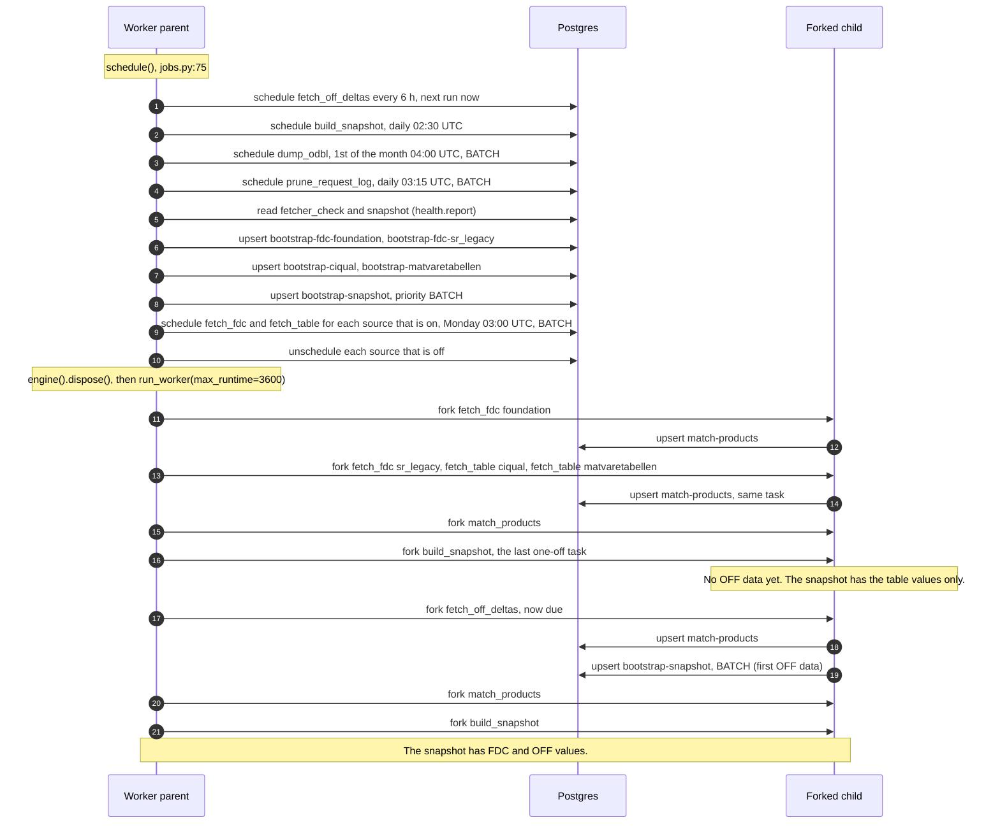
```mermaid
sequenceDiagram
    autonumber
    participant W as Worker parent
    participant Q as Postgres
    participant C as Forked child
    Note over W: schedule(), jobs.py:75
    W->>Q: schedule fetch_off_deltas every 6 h, next run now
    W->>Q: schedule build_snapshot, daily 02:30 UTC
    W->>Q: schedule dump_odbl, 1st of the month 04:00 UTC, BATCH
    W->>Q: schedule prune_request_log, daily 03:15 UTC, BATCH
    W->>Q: read fetcher_check and snapshot (health.report)
    W->>Q: upsert bootstrap-fdc-foundation, bootstrap-fdc-sr_legacy
    W->>Q: upsert bootstrap-ciqual, bootstrap-matvaretabellen
    W->>Q: upsert bootstrap-snapshot, priority BATCH
    W->>Q: schedule fetch_fdc and fetch_table for each source that is on, Monday 03:00 UTC, BATCH
    W->>Q: unschedule each source that is off
    Note over W: engine().dispose(), then run_worker(max_runtime=3600)
    W->>C: fork fetch_fdc foundation
    C->>Q: upsert match-products
    W->>C: fork fetch_fdc sr_legacy, fetch_table ciqual, fetch_table matvaretabellen
    C->>Q: upsert match-products, same task
    W->>C: fork match_products
    W->>C: fork build_snapshot, the last one-off task
    Note over C: No OFF data yet. The snapshot has the table values only.
    W->>C: fork fetch_off_deltas, now due
    C->>Q: upsert match-products
    C->>Q: upsert bootstrap-snapshot, BATCH (first OFF data)
    W->>C: fork match_products
    W->>C: fork build_snapshot
    Note over W,C: The snapshot has FDC and OFF values.
```

The worker parent registers the schedule, then forks one child per task (`cli.py:36`). It closes
its database pool before the first fork, so that no child inherits a connection (`cli.py:39`). The
match job imports Splink and DuckDB only in the child (`jobs.py:51`). Each task has a limit of one
hour (`cli.py:40`).

The pq worker takes one task at a time. It always takes a one-off task before a periodic task, and
a higher priority first (pq 0.8.1 `worker.py:722`, `worker.py:792`). This rule sets the first-boot
order above:

1. The FDC and national table tasks run first. Each one queues the match task. The client id
   `match-products` collapses the requests into one task (`jobs.py:84`). FDC Branded and Fineli
   are off by default, so a first boot does not fetch them.
2. The match task runs before the snapshot, because BATCH is the lowest priority.
3. The first snapshot runs next. It is the last one-off task.
4. Only then does the periodic OFF delta task run, although it was due at once.
5. The OFF delta queues the match task and a snapshot rebuild. The match task runs first, then the
   snapshot. Now the snapshot has OFF values.

A fetch that stores data queues a snapshot rebuild if no snapshot is newer than the first
successful run of that fetcher (`jobs.py:71`, `snapshot.py:34`). Thus the first data of each
fetcher gets into a snapshot without help. Later fetches wait for the nightly snapshot. The rebuild
uses the client id `bootstrap-snapshot`. Thus it collapses with the first-boot snapshot into one
pending task.

Each worker start registers the OFF schedule again with the next run set to now
(pq 0.8.1 `client.py:379`). Thus a restart of the worker always checks for OFF deltas at once.

The full OFF dump takes hours, which is more than the task limit. Run it with `fooddb run off-dump`
in its own container ([deploy.md](deploy.md#load-the-full-open-food-facts-dump)). It loads a dump
only once per `Last-Modified` value of the file (`fetchers/off.py:237`).

The OFF photo backfill (`backfill_off_images`, `off.backfill_images`, `fetchers/off.py:248`) is a one-off, and
no schedule starts it. New OFF records get their references at ingest, so only the OFF records stored
before that need it. It takes the `off:` records that have pending values and a null `images`, one at a
time, and asks `https://world.openfoodfacts.org/api/v2/product/<code>.json?fields=images,lang` with the
`User-Agent` `fooddb-images/0.1 (<repo URL>)`. OFF limits product reads to 15 a minute per IP (API
introduction, "Rate limits"). The job waits 8 s between products, which is 7.5 a minute, so about 2 hours for
870 records. The task limit is four hours (`jobs.py:18`). A product that OFF does not know (404), or
that has no front or nutrition photo, gets `{}`, so the next run skips it. A 429 or 503, or a network error, stops the run
and the next run continues with the records that are still null. Run it with `fooddb run off-images [--limit N]`
or `fooddb enqueue off-images` ([deploy.md](deploy.md#photo-references-for-the-review-page)).

FDC Branded can also take more than one hour. Its tasks have a limit of six hours (`jobs.py:18`).
While it runs, the worker runs no other task.

## Database schema

```mermaid
erDiagram
    product |o--o{ product : "merged_into"
    product ||--o{ food : "product_id"
    food ||--o{ observation : "food_id"
    snapshot ||--o{ snapshot_value : "day, on delete cascade"
    product ||--o{ merge_log : "from_product, into_product"
    food ||--o{ cannot_link : "food_a, food_b"
    account |o--o{ api_key : "account_id"
    account ||--o{ purchase : "account_id"
    account ||--o{ login_token : "account_id"
    account ||--o{ usage_month : "account_id"
    product {
        bigint id PK
        bigint merged_into FK "null means canonical, btree index"
        timestamptz created_at
    }
    food {
        text id PK "source:code"
        bigint product_id FK
        text source
        text layer "core or off"
        text licence
        text gtin14 "btree index"
        text name "GIN trigram index"
        text brand
        text lang
        text serving_text
        numeric serving_g
        text category "fooddb category, null when unknown"
        text_array flags "failed checks"
        jsonb images "OFF photo references, not the photos"
        timestamptz source_updated_at
        timestamptz fetched_at
    }
    observation {
        bigint id PK
        text food_id FK
        text nutrient "INFOODS tagname"
        numeric value_per_100 "null means withdrawn"
        text unit
        text basis "100g or 100ml"
        text status "accepted, pending, rejected"
        text source
        text licence
        timestamptz observed_at
        timestamptz ingested_at
        text reviewed_by "null until a review decision"
        timestamptz reviewed_at
        text review_note
        text evidence "sha256 of the label photo, null for other sources"
    }
    snapshot {
        date day PK
        timestamptz built_at
        int products
    }
    snapshot_value {
        date day PK,FK
        text scope PK "core or all"
        bigint product_id PK "no FK"
        text nutrient PK
        numeric value_per_100
        text unit
        text basis
        text source
        text licence
        timestamptz observed_at
        boolean approved "an approved label read"
    }
    fetch_run {
        bigint id PK
        text fetcher
        text ref "file or release"
        text status "running, done, failed"
        int foods
        int observations
        text error
        timestamptz started_at
        timestamptz finished_at
    }
    fetcher_check {
        text fetcher PK
        timestamptz checked_at
    }
    merge_log {
        bigint id PK
        timestamptz at "one value per match run"
        text kind "merge or split"
        bigint from_product FK
        bigint into_product FK
        text_array food_ids "records that moved, GIN index"
        float probability "merge only"
        float threshold "merge only"
        text by "split only"
        text note
    }
    cannot_link {
        text food_a PK,FK "food_a before food_b"
        text food_b PK,FK
        text by
        text note
        timestamptz created_at
    }
    api_key {
        bigint id PK
        text name "unique among active keys"
        text token_hash UK "PBKDF2-HMAC-SHA256, never the token"
        text_array scopes "read, contribute, review, admin"
        int rate_limit "null means the default"
        timestamptz created_at
        timestamptz last_used_at
        timestamptz revoked_at
        bigint account_id FK "null: made by the CLI, never charged"
    }
    account {
        bigint id PK
        text email UK "lower case"
        timestamptz created_at
        bigint credits "never below 0"
        bool unlimited
        text stripe_customer_id
    }
    purchase {
        bigint id PK
        bigint account_id FK
        text stripe_session_id UK "one row per paid session"
        int amount_cents
        text currency
        bigint credits
        timestamptz created_at
    }
    login_token {
        text token_hash PK "the token is mailed, never stored"
        bigint account_id FK
        timestamptz expires_at "15 minutes"
        timestamptz used_at "set once"
    }
    usage_month {
        bigint account_id PK,FK
        date month PK "first day, UTC"
        bigint requests
    }
    request_log {
        bigint id PK
        timestamptz at "index request_log_at_idx"
        text method
        text route "template, or (unmatched)"
        smallint status
        int latency_ms
        bigint bytes "response body"
        bigint key_id "no foreign key"
        text key_name
        bigint account_id "no foreign key"
        text ip_hash "8 hex digits of a keyed HMAC, or null"
    }
    admin_action {
        bigint id PK
        timestamptz at
        text by "name of the admin key"
        text action "grant-credits, set-unlimited, revoke-key, run-now"
        text detail "JSON"
    }
    rate_limit {
        text bucket PK "key:id or ip:address"
        timestamptz window_start "start of the minute"
        int hits
    }
```

Fourteen Alembic migrations make this schema:

- `0001` enables `pg_trgm` and creates `food`, `observation` and `fetch_run`
  (`alembic/versions/0001_initial_schema.py:16`). Its `food_value` view was the first resolver.
- `0002` adds `product` and `food.product_id`. It adds `basis`, `status` and `licence` to
  `observation`, with check constraints on `status` and `basis`. It makes `value_per_100`
  nullable and drops the `food_value` view (`alembic/versions/0002_products_and_value_status.py:14`).
- `0003` adds `snapshot` and `snapshot_value` (`alembic/versions/0003_snapshots.py:14`).
- `0004` adds `fetcher_check` (`alembic/versions/0004_fetcher_check.py:14`).
- `0005` indexes `product.merged_into` (`alembic/versions/0005_product_merged_into_idx.py:14`).
- `0006` adds `reviewed_by`, `reviewed_at` and `review_note` to `observation`, and the partial index
  `observation_pending_idx` on the pending rows for the review queue
  (`alembic/versions/0006_review_decisions.py:15`).
- `0007` adds `api_key` and the unlogged table `rate_limit` (`alembic/versions/0007_api_keys.py:16`).
  A crash can lose the counts of one minute, which is acceptable for a rate limit.
- `0008` adds `merge_log` and `cannot_link` (`alembic/versions/0008_merge_log_and_cannot_link.py:16`).
- `0009` adds `food.category` (`alembic/versions/0009_food_category.py:14`). Records stored before it
  have no category until a newer edit of the record arrives.
- `0010` adds `observation.evidence`, and the scope `contribute` to the check on `api_key.scopes`
  (`alembic/versions/0010_observation_evidence.py:19`).
- `0011` adds `snapshot_value.approved`, true for a value from an approved label read
  (`alembic/versions/0011_snapshot_value_approved.py:15`).
- `0012` adds `account`, `purchase`, `login_token` and `usage_month`, and `api_key.account_id`
  (`alembic/versions/0012_developer_portal.py:15`).
- `0013` drops the unique constraint `observation_once`, which dropped the withdrawal of a field when
  a record was seen again at the same `observed_at` (`alembic/versions/0013_observation_same_time_rows.py:15`).
- `0014` adds `request_log` with an index on `at`, and `admin_action`
  (`alembic/versions/0014_admin_panel.py:15`). Neither table has a foreign key, so the log keeps
  its rows if a key or an account goes away.

`observation` has no unique key. The comparison in `_observations` makes a re-run idempotent.
The index `observation_latest_idx` serves the "newest per record and nutrient" queries.
`snapshot_value.product_id` has no foreign key. `fetch_run.fetcher` and `fetcher_check.fetcher`
use the same names as the health report (`health.py:11`), but no constraint links them. pq creates
its own tables, `pq_tasks` and `pq_periodic`, through `fooddb migrate` (`cli.py:22`).

## Request flow

### `GET /v1/products/{barcode}`

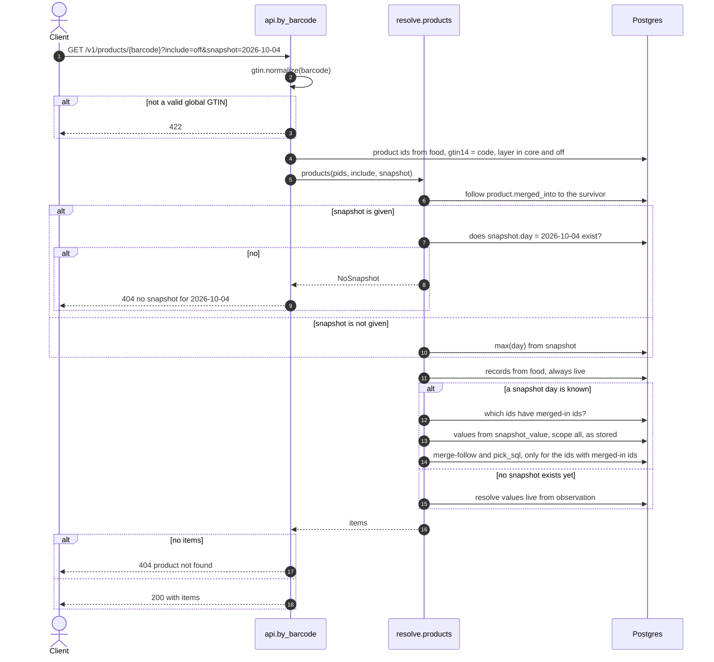
```mermaid
sequenceDiagram
    autonumber
    actor Cl as Client
    participant A as api.by_barcode
    participant R as resolve.products
    participant P as Postgres
    Cl->>A: GET /v1/products/{barcode}?include=off&snapshot=2026-10-04
    A->>A: gtin.normalize(barcode)
    alt not a valid global GTIN
        A-->>Cl: 422
    end
    A->>P: product ids from food, gtin14 = code, layer in core and off
    A->>R: products(pids, include, snapshot)
    R->>P: follow product.merged_into to the survivor
    alt snapshot is given
        R->>P: does snapshot.day = 2026-10-04 exist?
        alt no
            R-->>A: NoSnapshot
            A-->>Cl: 404 no snapshot for 2026-10-04
        end
    else snapshot is not given
        R->>P: max(day) from snapshot
    end
    R->>P: records from food, always live
    alt a snapshot day is known
        R->>P: which ids have merged-in ids?
        R->>P: values from snapshot_value, scope all, as stored
        R->>P: merge-follow and pick_sql, only for the ids with merged-in ids
    else no snapshot exists yet
        R->>P: resolve values live from observation
    end
    R-->>A: items
    alt no items
        A-->>Cl: 404 product not found
    else
        A-->>Cl: 200 with items
    end
```

`by_barcode` (`api.py:77`) does these steps:

1. It normalises the barcode. An invalid or non-global GTIN gets 422 (`api.py:79`).
2. It finds the products that have a record with this GTIN in the visible layers (`api.py:82`).
   Without `include=off`, only the `core` layer is visible (`resolve.py:107`).
3. `resolve.products` follows `merged_into` to the survivor product (`resolve.py:111`). A
   merged-away id thus answers as its survivor, with the survivor's id.
4. With `?snapshot=`, it checks that the day exists. A day that does not exist gets 404
   (`resolve.py:138`, `api.py:23`). Without `?snapshot=`, it uses the newest day.
5. It reads the records of each product from the live `food` table (`resolve.py:140`). The most
   trusted, newest record gives the name, brand, language, serving, category and flags.
   Each barcode is tagged with the most trusted record that has it (`resolve.py:152`).
6. It reads the values from `snapshot_value` for the day and scope. The scope is `all` with
   `include=off`, else `core` (`resolve.py:135`). The values include those of every product merged
   into this one after the build (`resolve.py:72`). If no snapshot exists, it resolves live.
7. No visible product gets 404. Without `include=off`, the message suggests `include=off`
   (`api.py:85`).

The product shape (API version 0.3.0):

| Field | Shape |
|---|---|
| `id`, `snapshot` | fooddb's own: the product id, and the day that the values come from |
| `records` | the ids of the visible source records |
| `name`, `brand`, `lang`, `serving_text`, `serving_g`, `category`, `flags` | `{value, source, licence, record}`, or `null` when the naming record has no value (`resolve.py:103`) |
| `gtin14` | a list of `{value, source, licence, record}`, one per barcode |
| `per_100` | per nutrient: `{value, unit, basis, source, licence, observed_at}` |
| `seals` | `{value, source, licence, record}`: `value` maps each scheme to `{seal: true or false}`, `source` is `fooddb`, `record` is `null`. `null` when no seal has its inputs (`resolve.py:110`) |

Every number in the response is a JSON number: `serving_g` and each `value` are read as floats, never as decimal strings. REST, MCP, the NDJSON export and the ODbL dump share this shape.

Without `include=off`, only `core` records are read. Thus no field of a core response comes from
the OFF layer, and no ODbL tag is in it.

The other read endpoints use the same `resolve.products` call:

- `GET /v1/foods?q=` searches `food.name` with `pg_trgm` word similarity (`api.py:49`).
- `GET /v1/foods/{product_id}` reads one product (`api.py:64`).
- `GET /v1/records/{record_id}` finds the product of one source record (`api.py:69`).

### `GET /v1/snapshots/{day}/export`

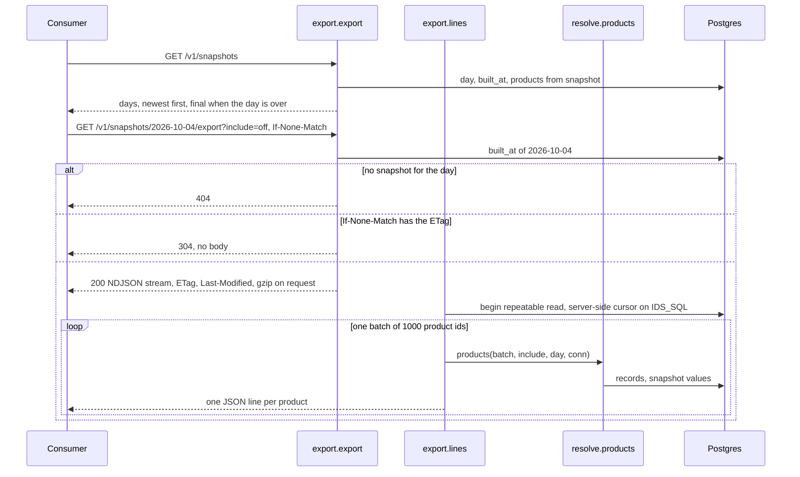
```mermaid
sequenceDiagram
    participant Cl as Consumer
    participant A as export.export
    participant G as export.lines
    participant R as resolve.products
    participant P as Postgres
    Cl->>A: GET /v1/snapshots
    A->>P: day, built_at, products from snapshot
    A-->>Cl: days, newest first, final when the day is over
    Cl->>A: GET /v1/snapshots/2026-10-04/export?include=off, If-None-Match
    A->>P: built_at of 2026-10-04
    alt no snapshot for the day
        A-->>Cl: 404
    else If-None-Match has the ETag
        A-->>Cl: 304, no body
    else
        A-->>Cl: 200 NDJSON stream, ETag, Last-Modified, gzip on request
        G->>P: begin repeatable read, server-side cursor on IDS_SQL
        loop one batch of 1000 product ids
            G->>R: products(batch, include, day, conn)
            R->>P: records, snapshot values
            G-->>Cl: one JSON line per product
        end
    end
```

The export router is in `export.py`. The app adds it with `include_router` and the `read`
dependency (`api.py:31`). See [Authentication](#authentication).

- `GET /v1/snapshots` lists the days, newest first (`export.py:34`). `final` is true when the day
  is before today (UTC). `products` counts the products with values in the `all` scope at build
  time, before later merges.
- `GET /v1/snapshots/{day}/export` gets 404 for a day with no snapshot (`export.py:81`). The ETag
  is weak and is made of the day, the scope and `built_at`. A final day is never rebuilt, so its
  ETag never changes. A matching `If-None-Match` gets 304 (`export.py:87`).
- `export.products` reads in one repeatable-read transaction (`export.py:46`). A rebuild or a
  merge during the export does not change what it sends. `export.lines` makes one JSON line of
  each product. The ODbL dump uses `export.products` too.
- `IDS_SQL` selects every product with values that day, and follows `merged_into` to the survivor
  (`export.py:23`). A server-side cursor fetches the ids in batches of `BATCH` (1000)
  (`export.py:53`). Each batch goes through `resolve.products`, so each line has the shape of
  `GET /v1/foods/{id}?snapshot=`. The process never holds the full export in memory.
- The export reads about 7000 products per second, the same at 20,000 and at 100,000 products.
  `scripts/bench_export.py` measures this on a development database that it seeds with synthetic
  products ([#31](https://github.com/eait-fit/fooddb/issues/31)).
- With `gzip` in `Accept-Encoding`, `export.gzipped` compresses the stream (`export.py:90`).
- `fooddb export --day --include-off --out` writes the same lines to a file, gzipped when the name
  ends in `.gz` (`cli.py:110`).

### `GET /v1/dumps`

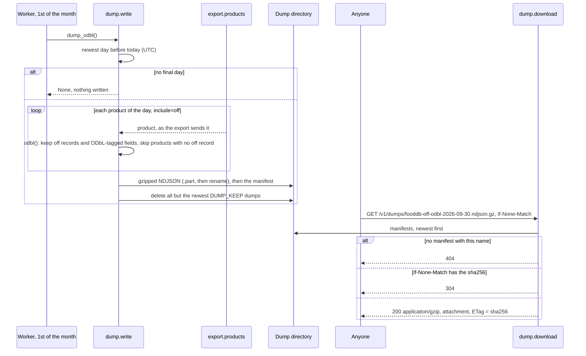
```mermaid
sequenceDiagram
    participant Wk as Worker, 1st of the month
    participant D as dump.write
    participant E as export.products
    participant F as Dump directory
    participant Cl as Anyone
    participant A as dump.download
    Wk->>D: dump_odbl()
    D->>D: newest day before today (UTC)
    alt no final day
        D-->>Wk: None, nothing written
    else
        loop each product of the day, include=off
            E-->>D: product, as the export sends it
            D->>D: odbl(): keep off records and ODbL-tagged fields, skip products with no off record
        end
        D->>F: gzipped NDJSON (.part, then rename), then the manifest
        D->>F: delete all but the newest DUMP_KEEP dumps
    end
    Cl->>A: GET /v1/dumps/fooddb-off-odbl-2026-09-30.ndjson.gz, If-None-Match
    A->>F: manifests, newest first
    alt no manifest with this name
        A-->>Cl: 404
    else If-None-Match has the sha256
        A-->>Cl: 304
    else
        A-->>Cl: 200 application/gzip, attachment, ETag = sha256
    end
```

`dump.py` writes and serves the monthly ODbL dump of the Open Food Facts layer.

- `dump.write` dumps the newest final day: the newest snapshot day before today (UTC)
  (`dump.py:47`). It reads the products with `export.products(day, "off")`, the same generator as
  the export. Thus each line has the export's shape, with the parts that are not ODbL removed.
- `dump.odbl` keeps a product only when it has an `off:` record (`dump.py:31`). It keeps the
  product id, the snapshot day and the `off:` record ids. It keeps each field, barcode and
  `per_100` value only when its `licence` is `ODbL-1.0`. A field that a core record gives becomes
  `null`. Thus the dump holds only what the API serves under ODbL with `include=off`.
- The file is `fooddb-off-odbl-DAY.ndjson.gz`. `dump.write` writes it to a `.part` file, then
  renames it. The manifest `fooddb-off-odbl-DAY.json` follows, the same way. It holds the day, the
  product count, the size, the SHA-256, the licence, the attribution and a link to
  [data-licence.md](data-licence.md). Then `dump.write` deletes the oldest dumps past
  `FOODDB__BACKEND__DUMP_KEEP` (default 3) (`dump.py:52`).
- The directory is `FOODDB__BACKEND__DUMP_DIR`, default `dumps` in the working directory.
- `GET /v1/dumps` lists the manifests, newest first (`dump.py:96`).
- `GET /v1/dumps/{name}` sends a file that a manifest names, with `Content-Disposition:
  attachment` (`dump.py:102`). Any other name gets 404. The ETag is the SHA-256 of the file. A
  matching `If-None-Match` gets 304.
- The app adds the router with the `auth.counted` dependency, not `read` (`api.py:32`). The ODbL
  requires open access, so the routes need no key, also when reads need one. See
  [Authentication](#authentication).

### `/livez` and `/healthz`

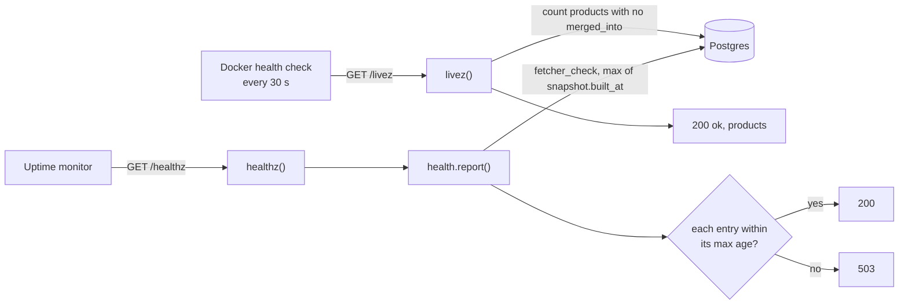
```mermaid
flowchart LR
    dock["Docker health check<br/>every 30 s"] -->|"GET /livez"| lz["livez()"]
    mon["Uptime monitor"] -->|"GET /healthz"| hz["healthz()"]
    lz -->|"count products with no merged_into"| db[("Postgres")]
    lz --> l200["200 ok, products"]
    hz --> rep["health.report()"]
    rep -->|"fetcher_check, max of snapshot.built_at"| db
    rep --> dec{"each entry within<br/>its max age?"}
    dec -->|yes| h200["200"]
    dec -->|no| h503["503"]
```

- `/livez` shows that the process is up and can query the database (`api.py:34`). It says
  nothing about the age of the data. A database error gives a 500, not a 200.
- `/healthz` shows freshness (`api.py:42`). It compares each `fetcher_check` row and the newest
  `snapshot.built_at` with a maximum age (`health.py:12`): `off-delta` 12 h, `fdc-foundation`,
  `fdc-sr_legacy`, `ciqual`, `cofid`, `frida`, `matvaretabellen`, `mext` and `tfda` 8 days, and `snapshot` 26 h. `fdc-branded` and
  `fineli` (8 days) count only when they are on (`health.py:35`). One stale entry or one entry with
  no row gives 503.
- A fetch that finds nothing new also counts as a successful check (`health.py:40`,
  `jobs.py:27`, `jobs.py:49`, `jobs.py:57`). The full OFF dump has no health entry.

### MCP

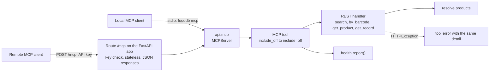
```mermaid
flowchart LR
    local["Local MCP client"] -->|"stdio: fooddb mcp"| srv["api.mcp<br/>MCPServer"]
    remote["Remote MCP client"] -->|"POST /mcp, API key"| route["Route /mcp on the FastAPI app<br/>key check, stateless, JSON responses"] --> srv
    srv --> tool["MCP tool<br/>include_off to include=off"]
    tool --> h["REST handler<br/>search, by_barcode, get_product, get_record"]
    tool --> rep["health.report()"]
    h --> R["resolve.products"]
    h -.->|"HTTPException"| err["tool error with the same detail"]
```

The MCP server is `mcp` in `api.py`. It uses the official MCP Python SDK (`MCPServer`). Each tool
calls the REST handler for the same read, so MCP and REST cannot answer differently:

| Tool | Calls | REST equivalent |
|---|---|---|
| `search_foods` | `search` | `GET /v1/foods?q=` |
| `get_product_by_barcode` | `by_barcode` | `GET /v1/products/{barcode}` |
| `get_food` | `get_product` | `GET /v1/foods/{product_id}` |
| `get_record_product` | `get_record` | `GET /v1/records/{record_id}` |
| `health_report` | `health.report` | `GET /healthz` |
| `review_queue` | `review_queue` | `GET /v1/review` |
| `decide_review` | `decide_review` | `POST /v1/review/{observation_id}` |
| `split_product` | `split_product` | `POST /v1/products/{product_id}/split` |
| `read_label` | `labels.reader().read`, stdio only | `POST /v1/labels` (with `submit=true`) |

- `include_off: true` becomes `include=off`. Without it, the tools return only the `core` layer.
  Each value keeps its `licence` tag, as in REST.
- `snapshot` pins a day, as `?snapshot=` does. `q` and `limit` have the same limits as REST.
- A 404, 409 or 422 from the handler becomes an MCP tool error with the same message.
- Over HTTP, the FastAPI lifespan runs the SDK's session manager. The route is stateless, so any
  API replica can answer any request.
- When `FOODDB__BACKEND__API_HOST` is `127.0.0.1` (the local default), the SDK refuses requests
  with a `Host` header other than localhost. In the image the value is `0.0.0.0`, so the check is
  off, and the reverse proxy sets the host.
- Over HTTP, every request to `/mcp` passes the same key check as a REST read (`api.py:214`). The
  review tools also need the `review` scope (`api.py:152`). Over stdio, no key is checked: the
  process is local and trusted. `decide_review` and `split_product` are its only writes.
  `read_label` writes nothing locally. See [Label reads](#label-reads). See [Review](#review).

### Authentication

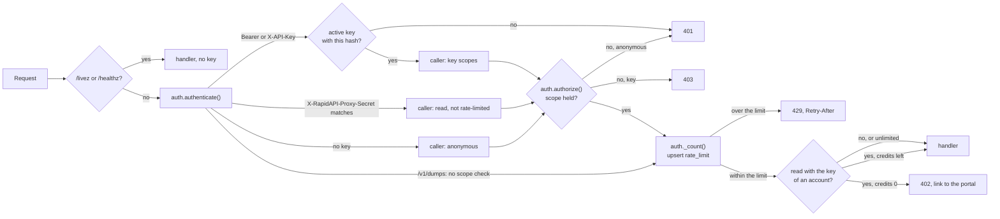
```mermaid
flowchart LR
    req["Request"] --> open{"/livez or /healthz?"}
    open -->|yes| ok["handler, no key"]
    open -->|no| who["auth.authenticate()"]
    who -->|"Bearer or X-API-Key"| key{"active key<br/>with this hash?"}
    key -->|no| e401["401"]
    key -->|yes| caller["caller: key scopes"]
    who -->|"X-RapidAPI-Proxy-Secret matches"| rapid["caller: read, not rate-limited"]
    who -->|"no key"| anon["caller: anonymous"]
    who -->|"/v1/dumps: no scope check"| count
    caller --> scope{"auth.authorize()<br/>scope held?"}
    rapid --> scope
    anon --> scope
    scope -->|"no, anonymous"| e401
    scope -->|"no, key"| e403["403"]
    scope -->|yes| count["auth._count()<br/>upsert rate_limit"]
    count -->|"over the limit"| e429["429, Retry-After"]
    count -->|"within the limit"| paid{"read with the key<br/>of an account?"}
    paid -->|"no, or unlimited"| handler["handler"]
    paid -->|"yes, credits left"| handler
    paid -->|"yes, credits 0"| e402["402, link to the portal"]
```

- A token is `fdb_` and 32 random bytes in URL-safe base64. `api_key` stores only its PBKDF2-HMAC-SHA256 under `FOODDB__BACKEND__SECRET_KEY`
  (`auth.py:43`). A lookup updates `last_used_at` in the same statement (`auth.py:66`).
- The scopes are `read`, `contribute`, `review` and `admin`. `contribute` implies `read`.
  `review` implies `read` and `contribute`. `admin` implies all of them (`auth.py:16`).
- `auth.require(scope)` is a FastAPI dependency (`auth.py:131`). The data reads and the export
  router use `read` (`api.py:30`). `review_router` uses `review` (`api.py:110`). `label_router` uses
  `contribute` (`api.py:162`). `brand_router` uses `contribute` too. The HTML form at
  `/brands/upload` has no dependency: it checks the key from its post itself.
- `auth.counted` is the dependency of `/v1/dumps` (`auth.py:145`). It authenticates the caller
  and counts the request against the rate limit, but checks no scope. Thus the dumps are open,
  also when `FOODDB__BACKEND__REQUIRE_KEY_FOR_READS` is `true`.
- An anonymous caller passes a `read` check only when `FOODDB__BACKEND__REQUIRE_KEY_FOR_READS` is
  not `true` (`auth.py:99`). A key that is unknown or revoked gets 401, even on an open read.
- A request with `X-RapidAPI-Proxy-Secret` equal to `FOODDB__BACKEND__RAPIDAPI_PROXY_SECRET` gets
  the `read` scope. The compare is in constant time (`auth.py:93`).
- The rate limit is a fixed window of one minute. Each request does one upsert on `rate_limit`
  (`auth.py:110`). The bucket is the key, or the client IP for anonymous reads. The limit is the
  key's `rate_limit`, else `FOODDB__BACKEND__RATE_LIMIT_PER_MINUTE` (default 60). All API replicas
  share the counters.
- A key can belong to an account. A `read` request with such a key, in the same transaction as the
  rate limit, runs `update account set credits = credits - 1 where credits > 0` and counts the
  request in `usage_month`, in one statement. At zero the API answers 402 `out of credits` with a
  `buy` link. A 429 costs no credit. Keys without an account, RapidAPI requests, writes, `/v1/dumps`
  and unlimited accounts are not charged. The next section shows the portal and its billing flow.
- The client IP comes from `X-Forwarded-For` when the peer is in
  `FOODDB__BACKEND__FORWARDED_ALLOW_IPS` (`cli.py:52`). The compose stack trusts every peer, because
  it publishes the port on loopback only.
- `/admin` logs in with an `admin` key (`admin.py:270`). The session cookie
  holds the key id and a random CSRF value, signed with `FOODDB__BACKEND__SECRET_KEY`. Each admin request checks that the
  key is still active. Without the secret, `admin.mount` does not mount `/admin` (`admin.py:294`).

### Developer portal and billing

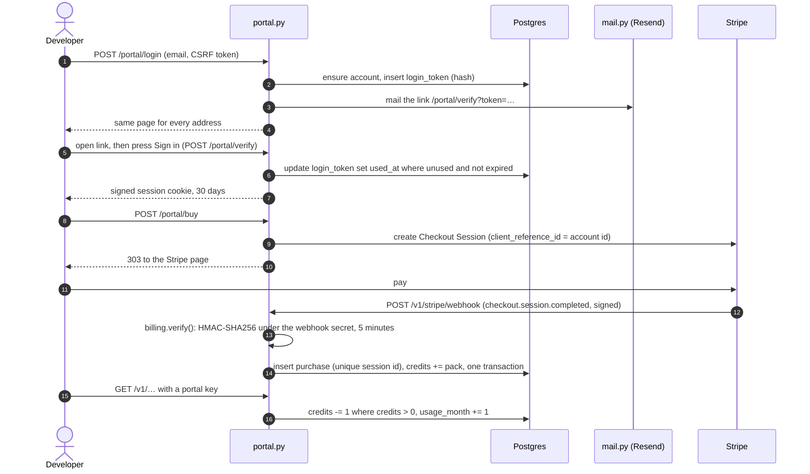
```mermaid
sequenceDiagram
    autonumber
    actor Dev as Developer
    participant P as portal.py
    participant DB as Postgres
    participant M as mail.py (Resend)
    participant S as Stripe
    Dev->>P: POST /portal/login (email, CSRF token)
    P->>DB: ensure account, insert login_token (hash)
    P->>M: mail the link /portal/verify?token=…
    P-->>Dev: same page for every address
    Dev->>P: open link, then press Sign in (POST /portal/verify)
    P->>DB: update login_token set used_at where unused and not expired
    P-->>Dev: signed session cookie, 30 days
    Dev->>P: POST /portal/buy
    P->>S: create Checkout Session (client_reference_id = account id)
    P-->>Dev: 303 to the Stripe page
    Dev->>S: pay
    S->>P: POST /v1/stripe/webhook (checkout.session.completed, signed)
    P->>P: billing.verify(): HMAC-SHA256 under the webhook secret, 5 minutes
    P->>DB: insert purchase (unique session id), credits += pack, one transaction
    Dev->>P: GET /v1/… with a portal key
    P->>DB: credits -= 1 where credits > 0, usage_month += 1
```

- `portal.py` serves the pages, `accounts.py` holds the queries, `billing.py` talks to Stripe with
  httpx, and `mail.py` is the mail port. The `log` backend writes mails to the server log, and
  only when `FOODDB__BACKEND__MAIL=log` is set.
- A sign-in link goes to `FOODDB__BACKEND__PUBLIC_URL`, never to the `Host` header. The link
  opens a page with a button, and the button posts the token. Thus a mail scanner that follows the
  link does not use up the token.
- The session is a cookie that `itsdangerous` signs with `FOODDB__BACKEND__SECRET_KEY`. It is
  `HttpOnly`, `SameSite=Lax`, valid 30 days, and `Secure` on https. Each form carries a CSRF token:
  an HMAC of a random cookie, which only the server can make. `/admin` has its own session.
- Sign-in requests are limited to 5 per hour per address and 20 per hour per client IP. Over the
  per-address limit, the page stays the same and no mail goes out.
- The webhook needs a valid signature and a paid session that carries `metadata.app = fooddb`.
  The unique `stripe_session_id` makes a second delivery change nothing.

## Planned, not built

[design.md](design.md) and [decisions.md](decisions.md) describe these parts. The code does not
have them yet. Dashed boxes and dashed arrows are planned. Solid boxes exist today.

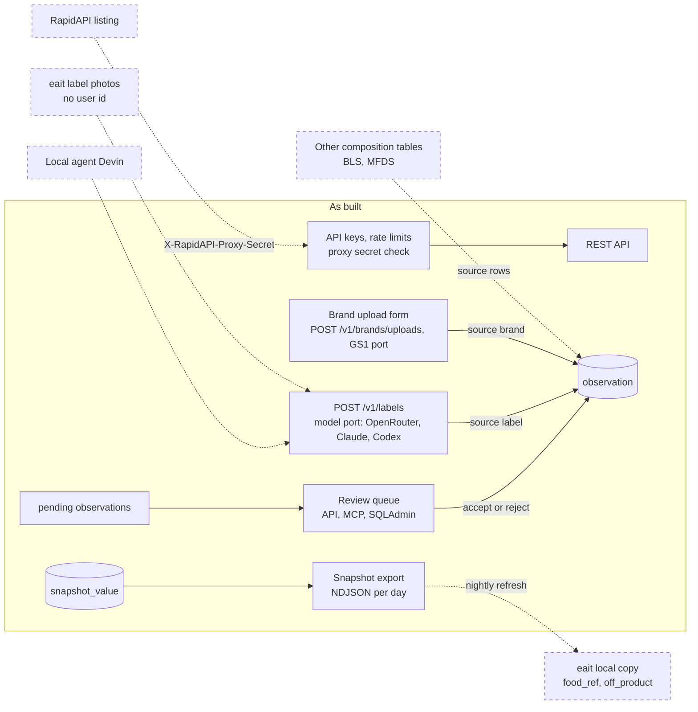
```mermaid
flowchart LR
    subgraph built["As built"]
        api["REST API"]
        auth["API keys, rate limits<br/>proxy secret check"]
        obs[("observation")]
        pend["pending observations"]
        review["Review queue<br/>API, MCP, SQLAdmin"]
        snap[("snapshot_value")]
        exp["Snapshot export<br/>NDJSON per day"]
        labels["POST /v1/labels<br/>model port: OpenRouter, Claude, Codex"]
        brand["Brand upload form<br/>POST /v1/brands/uploads, GS1 port"]
    end
    tables["Other composition tables<br/>BLS, MFDS"]
    eaitp["eait label photos<br/>no user id"]
    devin["Local agent Devin"]
    listing["RapidAPI listing"]
    eaitc["eait local copy<br/>food_ref, off_product"]
    tables -.->|"source rows"| obs
    brand -->|"source brand"| obs
    eaitp -.-> labels
    devin -.-> labels
    labels -->|"source label"| obs
    pend --> review
    review -->|"accept or reject"| obs
    listing -.->|"X-RapidAPI-Proxy-Secret"| auth
    auth --> api
    snap --> exp
    exp -.->|"nightly refresh"| eaitc
    classDef planned stroke-dasharray: 5 5
    class tables,eaitp,devin,listing,eaitc planned
```

- **Intake.** Other national composition tables: Korea MFDS
  ([#37](https://github.com/eait-fit/fooddb/issues/37)) and BLS. eait does not send label photos to
  `POST /v1/labels` yet.
- **GS1 verifier.** The brand upload form is built, but its verifier is `none`, so every brand
  upload waits for review. A real backend needs a decision on the cost of GS1 access.
- **Model port.** A Devin backend. The port has OpenRouter, Claude Code and Codex CLI.
- **RapidAPI listing.** The listing itself, which sells the REST API. The API already accepts the
  listing's proxy secret as a `read` key. See [Authentication](#authentication).
- **eait as a consumer.** eait keeps a read-only local copy and refreshes it from the snapshot
  export. The export exists. The eait job that loads it does not.
