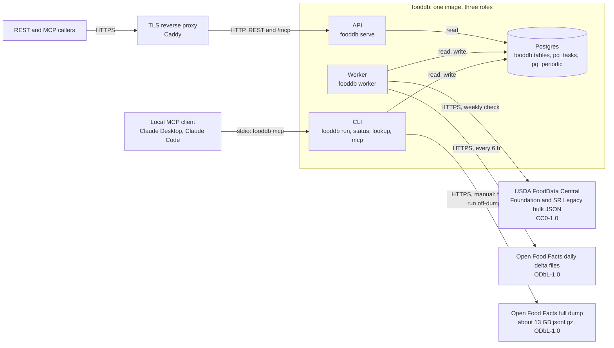
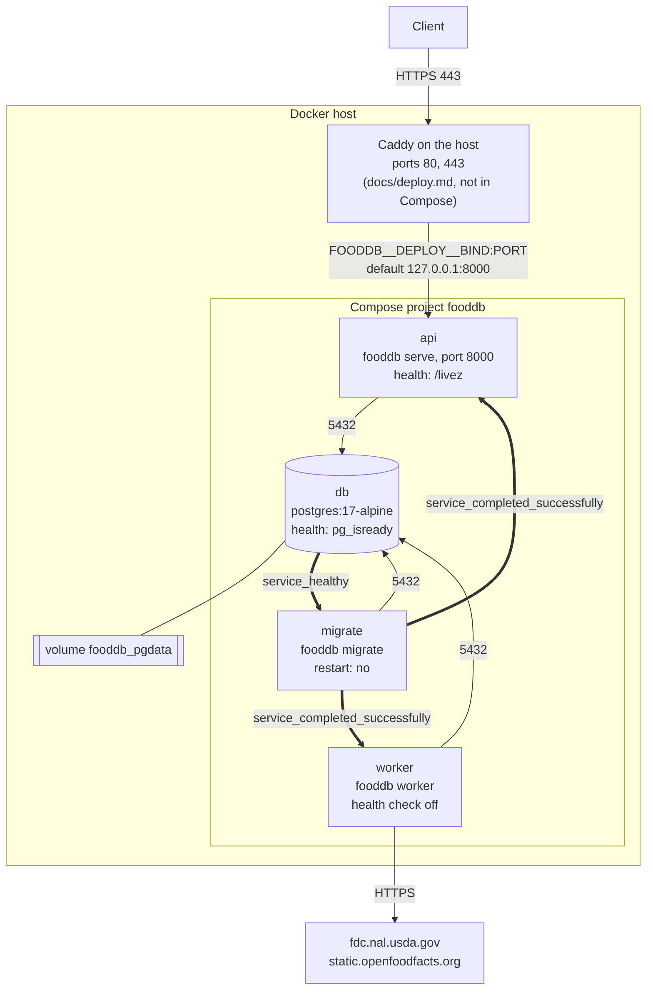
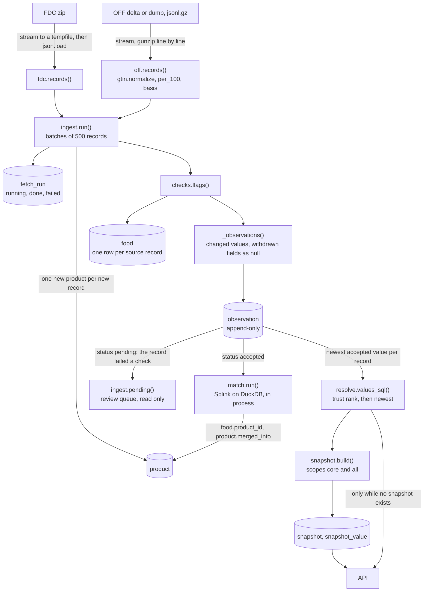
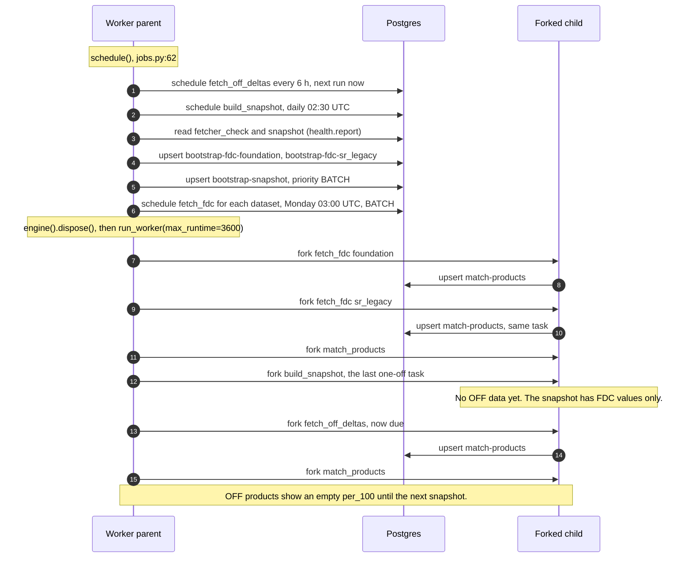
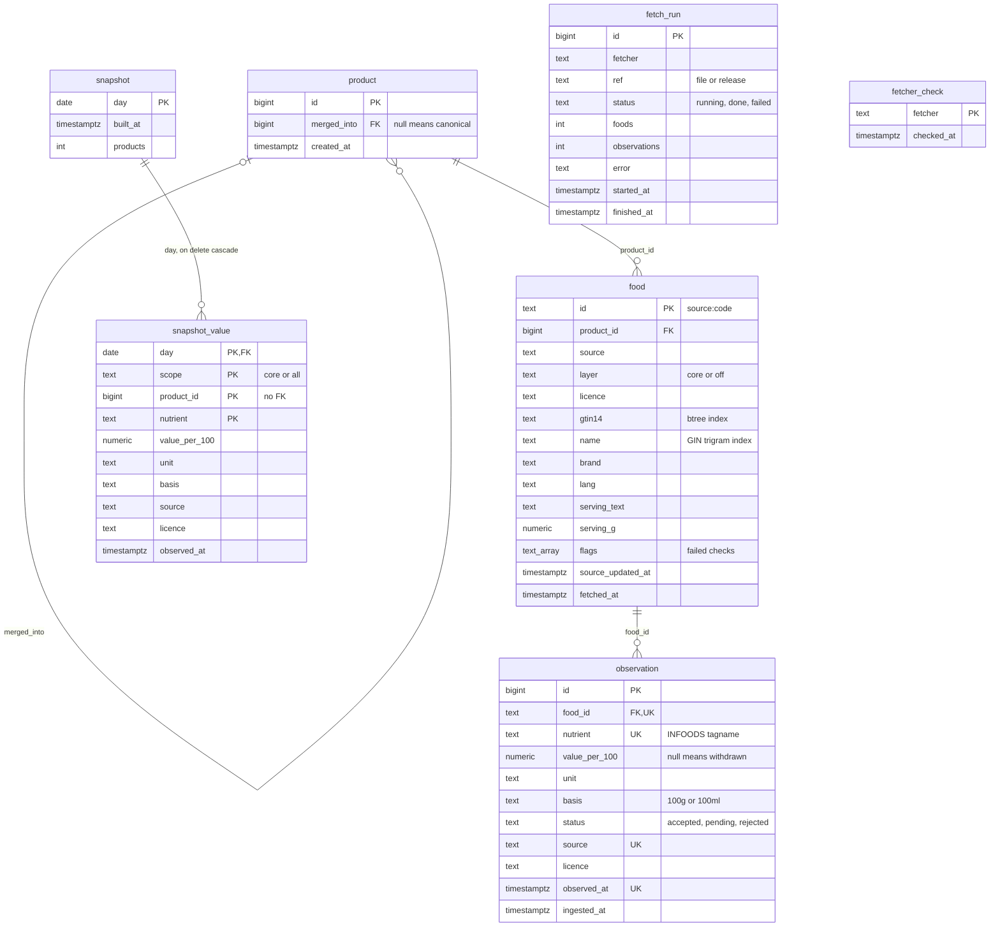
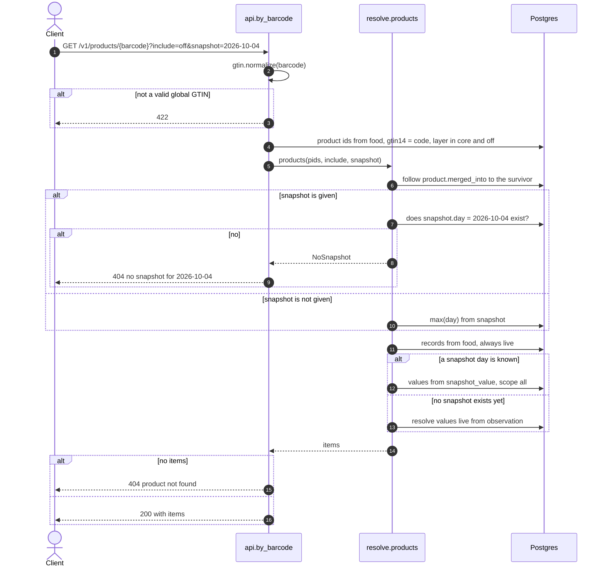
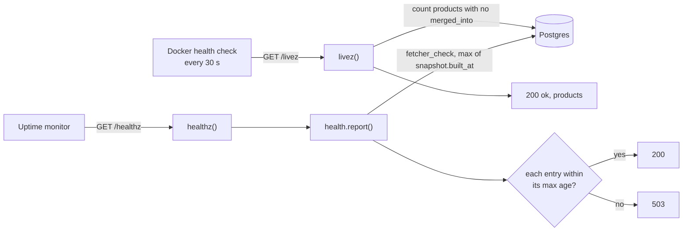
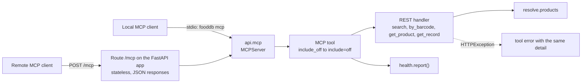
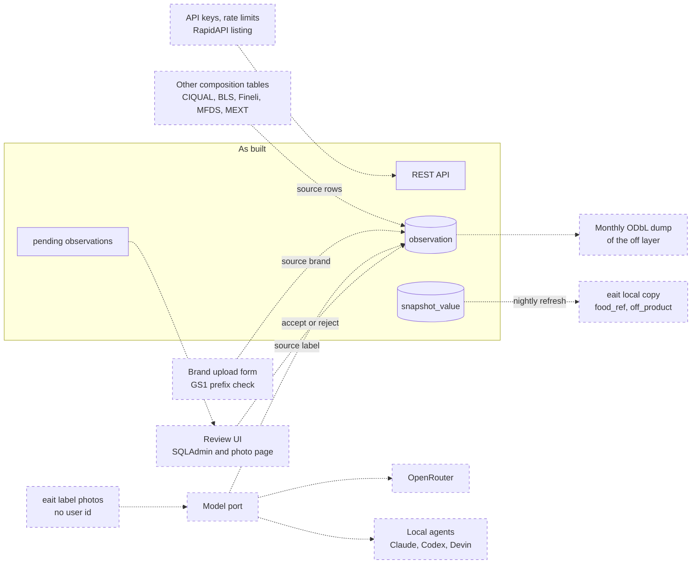

# Architecture

This document shows how fooddb works today: its parts, its deployment, and the flow of data from
the sources to the API. The diagrams show only code that exists. The last section,
[Planned, not built](#planned-not-built), shows what [design.md](design.md) describes but the code
does not have yet.

References have the form `file:line` and point to the code at commit `2480b2f`.

## System context

fooddb has three processes, and all of them come from one image (`Dockerfile:1`):

- The **API** (`fooddb serve`, `cli.py:43`) serves REST over FastAPI. It only reads. It also serves the MCP
  server over Streamable HTTP at `/mcp`. See [MCP](#mcp).
- The **worker** (`fooddb worker`, `cli.py:26`) runs the fetches, the match job and the snapshot.
  The queue is [pq](https://github.com/ricwo/pq), which keeps its tasks in the same Postgres
  database (`jobs.py:14`).
- The **CLI** (`cli.py`) applies migrations, runs one job in the foreground, and shows the status.
  `fooddb lookup` calls the API function in its own process, not over HTTP (`cli.py:103`).
  `fooddb mcp` runs the MCP server on stdio for a local client.

The worker fetches from two upstream sources. Each value keeps the licence of its source:
`CC0-1.0` for FDC (`fetchers/fdc.py:53`) and `ODbL-1.0` for Open Food Facts (`fetchers/off.py:19`).
The worker never fetches the full OFF dump on a schedule. An operator starts it by hand
(`jobs.py:62`, [deploy.md](deploy.md#load-the-full-open-food-facts-dump)).

eait is not in this diagram. No code in fooddb or in eait reads the snapshot for eait yet. See
[Planned, not built](#planned-not-built).

## Deployment

Thin arrows are network traffic. Thick arrows are the start order.

[`deploy/docker-compose.yml`](../deploy/docker-compose.yml) defines four services:

- `db` keeps its data in the `pgdata` volume (`deploy/docker-compose.yml:21`). Compose names it
  `fooddb_pgdata`, because the project name is `fooddb` (`deploy/docker-compose.yml:3`).
- `migrate` starts when `db` is healthy (`deploy/docker-compose.yml:33`). It applies the Alembic
  migrations, then the pq migrations, and stops (`cli.py:21`).
- `api` and `worker` start only after `migrate` stops with success
  (`deploy/docker-compose.yml:42`, `deploy/docker-compose.yml:49`). A failed migration keeps both
  of them down.
- Compose publishes the API port on the loopback address only (`deploy/docker-compose.yml:41`).
  A TLS reverse proxy on the host forwards to it. [deploy.md](deploy.md#tls-with-caddy) shows the
  Caddy configuration.

The image health check calls `/livez` every 30 seconds (`Dockerfile:20`). The worker turns it off
(`deploy/docker-compose.yml:48`), because the worker serves no HTTP.

### The eait production variant

eait runs the same image in its own Compose file, `deploy/docker-compose.prod.yml` in the eait
repo. It serves `https://food-api.eait.fit` since 2026-10-05. The
services are `fooddb-db`, `fooddb-migrate`, `fooddb-api` and `fooddb-worker`, with the same start
order. eait's Caddy serves `food-api.eait.fit` and forwards to `fooddb-api:8000`. `fooddb-db` is
on an internal network that only fooddb uses. `fooddb-api` is also on eait's `internal` network,
where Caddy is. `fooddb-worker` also joins the `fooddb-egress` network for its fetches.

## Data flow: from ingest to the API

### Fetch

Both fetchers read their source as a stream.

- The FDC fetcher finds the newest release on the FDC download page (`fetchers/fdc.py:29`). It
  writes the zip to a tempfile, then loads the JSON file into memory (`fetchers/fdc.py:64`,
  `fetchers/fdc.py:72`). The two datasets are small, so this is acceptable.
- The OFF fetcher decompresses each `.gz` file as it arrives and yields one line at a time
  (`fetchers/off.py:111`). The file never goes to disk. A delta file and the 13 GB dump use the
  same path (`fetchers/off.py:126`).
- The delta fetcher takes every file in the OFF index that is not done yet. On the first run it
  takes only the newest file (`fetchers/off.py:132`).

### Normalise

- `gtin.normalize` stores each barcode as a GTIN-14 with a valid check digit. It rejects
  restricted-circulation and coupon prefixes: 02, 04, 05, 20–29, 98 and 99 (`gtin.py:3`). An OFF
  product without a valid global GTIN is skipped (`fetchers/off.py:94`).
- Nutrients use INFOODS tagnames: `ENERC_KCAL`, `PROCNT`, `FAT`, `CHOCDF`, `SUGAR`, `FASAT`,
  `FIBTG` and `NA` (`fetchers/off.py:22`, `fetchers/fdc.py:22`).
- Units are kcal for energy, mg for sodium and g for all other nutrients (`ingest.py:14`). The OFF
  fetcher converts kJ-only energy to kcal (`fetchers/off.py:63`).
- Each value records its basis, `100g` or `100ml` (`fetchers/off.py:76`).
- Record ids have the form `<source>:<code>`, for example `fdc:168421` or `off:<gtin14>`.

### Store observations

`ingest.run` writes one `fetch_run` row per file or release (`ingest.py:78`). It marks a run that a
killed process left in `running` as `failed` (`ingest.py:83`). A run that stores no records fails
with `EmptyRun`, because that usually means the source format changed (`ingest.py:95`).

For each batch, `_write` does these steps (`ingest.py:104`):

1. It creates one `product` row for each record that it did not see before (`ingest.py:114`).
2. It runs the checks on the record (`ingest.py:122`). The failed check names go into `food.flags`.
3. It upserts the `food` row. An older file cannot overwrite newer metadata (`ingest.py:139`).
4. It inserts observations only for values that changed, and a null value for each field that the
   source removed (`ingest.py:158`). A duplicate observation is ignored (`ingest.py:145`).

The `observation` table is append-only. The code never updates or deletes an observation.

### Checks and review status

`checks.flags` runs five checks per record (`checks.py:6`):

- Atwater energy against the macros
- protein, fat and carbohydrate over 100 g
- sugars over carbohydrate, and saturates over fat
- negative values

The checks flag values, but they do not change them.

If a record fails one check, all its new observations get the status `pending` (`ingest.py:172`).
The resolver and the match job read only `accepted` observations (`resolve.py:24`, `match.py:35`).
Thus the last accepted value stays in service. `ingest.pending()` lists the pending values
(`ingest.py:56`). No API endpoint, CLI command or UI calls it, and no code sets an observation to
`accepted` or `rejected` after the insert.

### Match records into products

`match.run` loads every record with its newest accepted energy and macros (`match.py:24`). Splink
compares only candidate pairs (`match.py:109`). A pair has the same GTIN, or the same name words at
a similar energy, or the same brand and first word at a similar energy. Clusters at or above
`FOODDB__BACKEND__MATCH_THRESHOLD` (default 0.95, `match.py:22`) merge. The lowest product id
survives. The other products get `merged_into`, and their `food` rows move to the survivor
(`match.py:158`). The match job never splits a product again.

### Resolve

The resolver picks one value per product and nutrient (`resolve.py:17`):

1. Per source record, it takes the newest accepted observation of each nutrient.
2. It drops the nulls. A withdrawn field thus falls back to the other records of the product.
3. Across records, the most trusted source wins: `brand`, then `label`, then `fdc`, then `off`
   (`resolve.py:15`). The newest value breaks a tie.

The `include=off` parameter adds the `off` layer to the query (`resolve.py:52`). Without it, OFF
values do not take part.

### Snapshot

`snapshot.build` writes the resolved values of all products for one UTC day, in one transaction
(`snapshot.py:13`). It writes two scopes: `core` (core layer only) and `all` (core and OFF). A
second build on the same day replaces that day (`snapshot.py:18`). The build deletes days that are
more than 30 days older than the new day (`snapshot.py:30`).

The API reads values from the newest snapshot, or from the day that `?snapshot=` pins
(`resolve.py:82`). Before the first snapshot exists, the API resolves values live
(`resolve.py:86`). The snapshot holds only values. Record lists, names and merges always come from
the live tables (`resolve.py:76`).

## Jobs and schedules

| Job | Function | Trigger | Priority |
|---|---|---|---|
| OFF deltas | `fetch_off_deltas` | every 6 h (`jobs.py:65`) | NORMAL |
| Snapshot | `build_snapshot` | cron `30 2 * * *`, UTC (`jobs.py:66`) | NORMAL |
| FDC Foundation, FDC SR Legacy | `fetch_fdc` | cron `0 3 * * 1`, UTC (`jobs.py:76`) | BATCH |
| Match | `match_products` | after a fetch that stored data (`jobs.py:57`) | NORMAL |
| First-boot FDC | `fetch_fdc` | once, when `fetcher_check` has no row (`jobs.py:70`) | NORMAL |
| First-boot snapshot | `build_snapshot` | once, when no snapshot exists (`jobs.py:73`) | BATCH |
| OFF full dump | `fetch_off_dump` | manual only (`cli.py:68`) | – |

pq evaluates cron in UTC (pq 0.8.1 `client.py:374`).

The worker parent registers the schedule, then forks one child per task (`cli.py:36`). It closes
its database pool before the first fork, so that no child inherits a connection (`cli.py:39`). The
match job imports Splink and DuckDB only in the child (`jobs.py:44`). Each task has a limit of one
hour (`cli.py:40`).

The pq worker takes one task at a time. It always takes a one-off task before a periodic task, and
a higher priority first (pq 0.8.1 `worker.py:722`, `worker.py:792`). This rule sets the first-boot
order above:

1. The two FDC tasks run first. Each one queues the match task. The client id `match-products`
   collapses the two requests into one task (`jobs.py:59`).
2. The match task runs before the snapshot, because BATCH is the lowest priority.
3. The first snapshot runs next. It is the last one-off task.
4. Only then does the periodic OFF delta task run, although it was due at once.

**Known gap.** The first snapshot runs before the first OFF delta. Thus OFF products have an empty
`per_100` until the nightly snapshot at 02:30 UTC. [deploy.md](deploy.md#first-boot) tells the
operator to run `fooddb run snapshot` once after `/healthz` returns 200. The sequence in
deploy.md also leaves out the match task that runs after the FDC fetches.

Each worker start registers the OFF schedule again with the next run set to now
(pq 0.8.1 `client.py:379`). Thus a restart of the worker always checks for OFF deltas at once.

The full OFF dump takes hours, which is more than the task limit. Run it with `fooddb run off-dump`
in its own container ([deploy.md](deploy.md#load-the-full-open-food-facts-dump)). It loads a dump
only once per `Last-Modified` value of the file (`fetchers/off.py:159`).

## Database schema

Four Alembic migrations make this schema:

- `0001` enables `pg_trgm` and creates `food`, `observation` and `fetch_run`
  (`alembic/versions/0001_initial_schema.py:16`). Its `food_value` view was the first resolver.
- `0002` adds `product` and `food.product_id`. It adds `basis`, `status` and `licence` to
  `observation`, with check constraints on `status` and `basis`. It makes `value_per_100`
  nullable and drops the `food_value` view (`alembic/versions/0002_products_and_value_status.py:14`).
- `0003` adds `snapshot` and `snapshot_value` (`alembic/versions/0003_snapshots.py:14`).
- `0004` adds `fetcher_check` (`alembic/versions/0004_fetcher_check.py:14`).

The unique constraint `observation_once` covers `food_id`, `nutrient`, `source` and `observed_at`.
The index `observation_latest_idx` serves the "newest per record and nutrient" queries.
`snapshot_value.product_id` has no foreign key. `fetch_run.fetcher` and `fetcher_check.fetcher`
use the same names as the health report (`health.py:11`), but no constraint links them. pq creates
its own tables, `pq_tasks` and `pq_periodic`, through `fooddb migrate` (`cli.py:22`).

## Request flow

### `GET /v1/products/{barcode}`

`by_barcode` (`api.py:77`) does these steps:

1. It normalises the barcode. An invalid or non-global GTIN gets 422 (`api.py:79`).
2. It finds the products that have a record with this GTIN in the visible layers (`api.py:82`).
   Without `include=off`, only the `core` layer is visible (`resolve.py:52`).
3. `resolve.products` follows `merged_into` to the survivor product (`resolve.py:56`).
4. With `?snapshot=`, it checks that the day exists. A day that does not exist gets 404
   (`resolve.py:83`, `api.py:23`). Without `?snapshot=`, it uses the newest day.
5. It reads the records of each product from the live `food` table (`resolve.py:85`). The most
   trusted, newest record gives the name, brand and serving (`resolve.py:91`).
6. It reads the values from `snapshot_value` for the day and scope. The scope is `all` with
   `include=off`, else `core` (`resolve.py:80`). If no snapshot exists, it resolves live.
7. No visible product gets 404. Without `include=off`, the message suggests `include=off`
   (`api.py:85`).

A value in `per_100` carries its `source`, `licence`, `basis` and `observed_at`
(`resolve.py:99`). The response field `snapshot` shows the day that the values come from.

The other read endpoints use the same `resolve.products` call:

- `GET /v1/foods?q=` searches `food.name` with `pg_trgm` word similarity (`api.py:49`).
- `GET /v1/foods/{product_id}` reads one product (`api.py:64`).
- `GET /v1/records/{record_id}` finds the product of one source record (`api.py:69`).

### `/livez` and `/healthz`

- `/livez` shows that the process is up and can query the database (`api.py:34`). It says
  nothing about the age of the data. A database error gives a 500, not a 200.
- `/healthz` shows freshness (`api.py:42`). It compares each `fetcher_check` row and the newest
  `snapshot.built_at` with a maximum age (`health.py:11`): `off-delta` 12 h, `fdc-foundation` and
  `fdc-sr_legacy` 8 days, and `snapshot` 26 h. One stale entry or one entry with no row gives 503.
- A fetch that finds nothing new also counts as a successful check (`health.py:19`,
  `jobs.py:21`, `jobs.py:37`). The full OFF dump has no health entry.

### MCP

The MCP server is `mcp` in `api.py`. It uses the official MCP Python SDK (`MCPServer`). Each tool
calls the REST handler for the same read, so MCP and REST cannot answer differently:

| Tool | Calls | REST equivalent |
|---|---|---|
| `search_foods` | `search` | `GET /v1/foods?q=` |
| `get_product_by_barcode` | `by_barcode` | `GET /v1/products/{barcode}` |
| `get_food` | `get_product` | `GET /v1/foods/{product_id}` |
| `get_record_product` | `get_record` | `GET /v1/records/{record_id}` |
| `health_report` | `health.report` | `GET /healthz` |

- `include_off: true` becomes `include=off`. Without it, the tools return only the `core` layer.
  Each value keeps its `licence` tag, as in REST.
- `snapshot` pins a day, as `?snapshot=` does. `q` and `limit` have the same limits as REST.
- A 404 or 422 from the handler becomes an MCP tool error with the same message.
- Over HTTP, the FastAPI lifespan runs the SDK's session manager. The route is stateless, so any
  API replica can answer any request.
- When `FOODDB__BACKEND__API_HOST` is `127.0.0.1` (the local default), the SDK refuses requests
  with a `Host` header other than localhost. In the image the value is `0.0.0.0`, so the check is
  off, and the reverse proxy sets the host.
- The MCP server has no authentication, like the REST API.

## Planned, not built

[design.md](design.md) and [decisions.md](decisions.md) describe these parts. The code does not
have them yet. Dashed boxes and dashed arrows are planned. Solid boxes exist today.

- **Intake.** Other national composition tables, the brand upload form with its GS1 prefix
  check, and label reads from eait photos. The resolver already ranks the sources `brand` and
  `label` above `fdc` (`resolve.py:15`), but no fetcher writes them.
- **Model port.** One port for all LLM work, with OpenRouter for the hosted pipeline and local
  agents for customers' own runs.
- **Review.** A review UI on SQLAdmin, plus a page that shows the photo next to the fields that
  differ. Agents use the same queue through the API. Today no code changes the status of a pending
  observation.
- **Checks.** Ranges per category, and front-of-pack warning seals.
- **Access.** API keys, rate limits and the RapidAPI listing. The REST API and the MCP server have
  no authentication today.
- **eait as a consumer.** eait keeps a read-only local copy and refreshes it from the nightly
  snapshot. No export endpoint or eait job exists yet.
- **ODbL dump.** A monthly ODbL dump of the OFF-derived layer.
