# Architecture

This document shows how fooddb works today: its parts, its deployment, and the flow of data from
the sources to the API. The diagrams show only code that exists. The last section,
[Planned, not built](#planned-not-built), shows what [design.md](design.md) describes but the code
does not have yet.

References have the form `file:line` and point to the code at commit `2480b2f`.

## System context

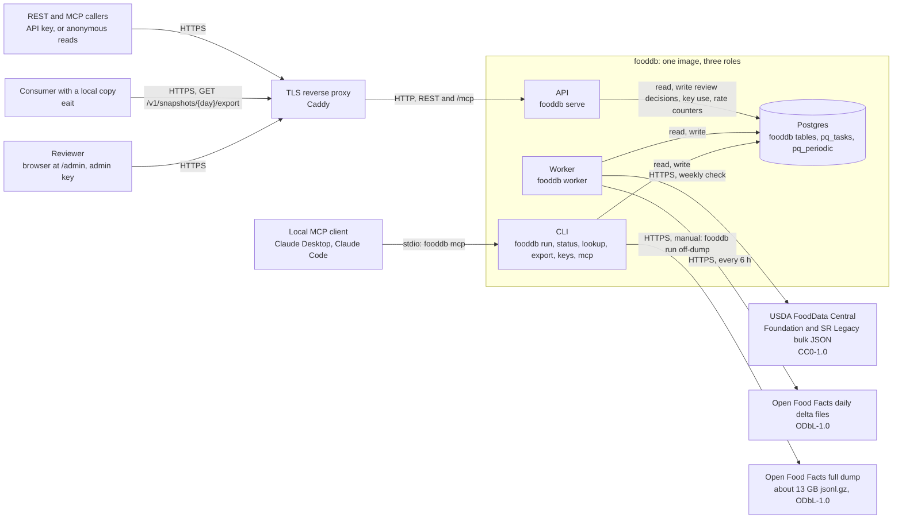

fooddb has three processes, and all of them come from one image (`Dockerfile:1`):

- The **API** (`fooddb serve`, `cli.py:43`) serves REST over FastAPI. Its only data write is a
  review decision. It also serves the MCP server over Streamable HTTP at `/mcp` (see [MCP](#mcp)),
  and the SQLAdmin review UI at `/admin` (see [Review](#review)). It checks API keys and rate
  limits on each request (see [Authentication](#authentication)).
- The **worker** (`fooddb worker`, `cli.py:26`) runs the fetches, the match job and the snapshot.
  The queue is [pq](https://github.com/ricwo/pq), which keeps its tasks in the same Postgres
  database (`jobs.py:14`).
- The **CLI** (`cli.py`) applies migrations, runs one job in the foreground, and shows the status.
  `fooddb lookup` calls the API function in its own process, not over HTTP (`cli.py:103`).
  `fooddb mcp` runs the MCP server on stdio for a local client. `fooddb export` writes one day's
  snapshot to a file with the same code as the export endpoint (`cli.py:107`). `fooddb keys`
  creates, lists and revokes API keys (`cli.py:128`).

The worker fetches from two upstream sources. Each value keeps the licence of its source:
`CC0-1.0` for FDC (`fetchers/fdc.py:54`) and `ODbL-1.0` for Open Food Facts (`fetchers/off.py:19`).
The worker never fetches the full OFF dump on a schedule. An operator starts it by hand
(`jobs.py:68`, [deploy.md](deploy.md#load-the-full-open-food-facts-dump)).

A consumer that keeps a local copy, such as eait, reads the snapshot export. See
[`GET /v1/snapshots/{day}/export`](#get-v1snapshotsdayexport). The eait job that loads the export
is not built. See [Planned, not built](#planned-not-built).

## Deployment

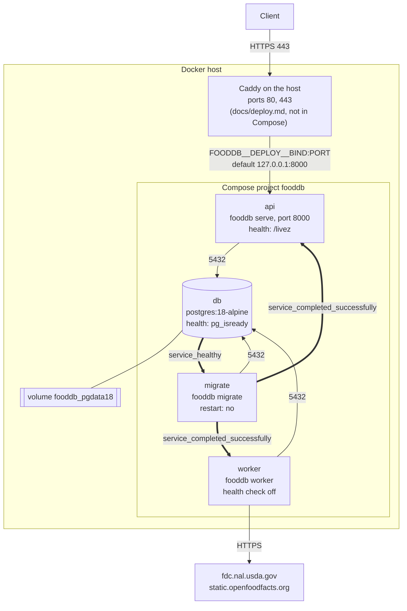

Thin arrows are network traffic. Thick arrows are the start order.

[`deploy/docker-compose.yml`](../deploy/docker-compose.yml) defines four services:

- `db` keeps its data in the `pgdata18` volume (`deploy/docker-compose.yml:21`). Compose names it
  `fooddb_pgdata18`, because the project name is `fooddb` (`deploy/docker-compose.yml:3`).
- `migrate` starts when `db` is healthy (`deploy/docker-compose.yml:33`). It applies the Alembic
  migrations, then the pq migrations, and stops (`cli.py:21`).
- `api` and `worker` start only after `migrate` stops with success
  (`deploy/docker-compose.yml:42`, `deploy/docker-compose.yml:49`). A failed migration keeps both
  of them down.
- Compose publishes the API port on the loopback address only (`deploy/docker-compose.yml:41`).
  A TLS reverse proxy on the host forwards to it. [deploy.md](deploy.md#tls-with-caddy) shows the
  Caddy configuration.

The image health check calls `/livez` every 30 seconds (`Dockerfile:20`). The worker turns it off
(`deploy/docker-compose.yml:48`), because the worker serves no HTTP.

### The eait production variant

eait runs the same image in its own Compose file, `deploy/docker-compose.prod.yml` in the eait
repo. It serves `https://food-api.eait.fit` since 2026-10-05. The
services are `fooddb-db`, `fooddb-migrate`, `fooddb-api` and `fooddb-worker`, with the same start
order. eait's Caddy serves `food-api.eait.fit` and forwards to `fooddb-api:8000`. `fooddb-db` is
on an internal network that only fooddb uses. `fooddb-api` is also on eait's `internal` network,
where Caddy is. `fooddb-worker` also joins the `fooddb-egress` network for its fetches.

## Data flow: from ingest to the API

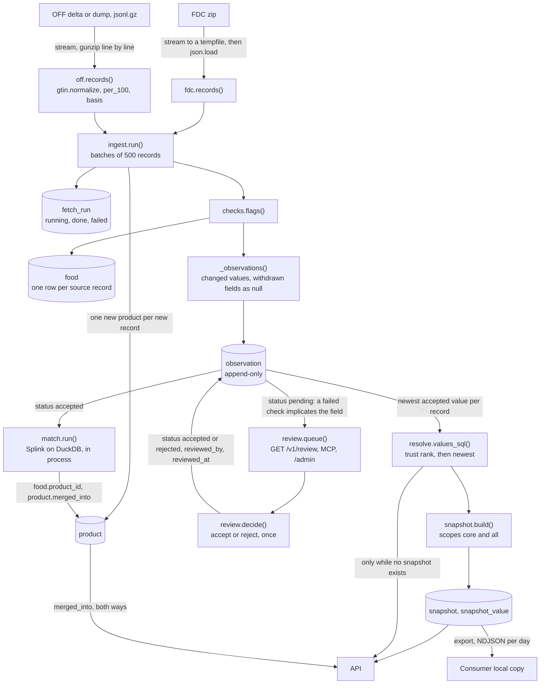

### Fetch

Both fetchers read their source as a stream.

- The FDC fetcher finds the newest release on the FDC download page (`fetchers/fdc.py:30`). It
  writes the zip to a tempfile, then loads the JSON file into memory (`fetchers/fdc.py:65`,
  `fetchers/fdc.py:73`). The two datasets are small, so this is acceptable.
- The OFF fetcher decompresses each `.gz` file as it arrives and yields one line at a time
  (`fetchers/off.py:147`). The file never goes to disk. A delta file and the 13 GB dump use the
  same path (`fetchers/off.py:162`).
- The delta fetcher takes every file in the OFF index that is not done yet. On the first run it
  takes only the newest file (`fetchers/off.py:168`).

### Normalise

- `gtin.normalize` stores each barcode as a GTIN-14 with a valid check digit. It rejects
  restricted-circulation and coupon prefixes: 02, 04, 05, 20–29, 98 and 99 (`gtin.py:3`). An OFF
  product without a valid global GTIN is skipped (`fetchers/off.py:129`).
- Nutrients use INFOODS tagnames: `ENERC_KCAL`, `ENERC_KJ`, `PROCNT`, `FAT`, `CHOCDF`, `CHOAVL`,
  `SUGAR`, `FASAT`, `FIBTG` and `NA` (`fetchers/off.py:23`, `fetchers/fdc.py:23`).
- Each value keeps the code of the quantity that the source states. The code converts no value
  from one code to another, except kJ to kcal (below).
- Carbohydrate has two codes. `CHOCDF` is carbohydrate by difference, with fibre. `CHOAVL` is
  available carbohydrate, without fibre. FDC nutrient 1005 is `CHOCDF`. FDC has no available
  carbohydrate.
- OFF's `carbohydrates` is the value on the label. `carbs_code` takes its code from the product's
  `countries_tags` (`fetchers/off.py:60`):

  | Markets in `countries_tags` | Code | Flag |
  |---|---|---|
  | US or Canada only | `CHOCDF` | none |
  | EU, UK, Switzerland, Norway, Iceland, Liechtenstein, Australia or New Zealand only | `CHOAVL` | none |
  | both groups, or neither | `CHOCDF` | `carbs-regime-unknown` in `food.flags` |

  OFF's `carbohydrates-total` (fibre included) is always `CHOCDF`.
- Units are kcal and kJ for energy, mg for sodium and g for all other nutrients (`ingest.py:14`).
  `ENERC_KCAL` is the canonical energy. When a source states kJ, the fetcher also keeps the kJ value
  as `ENERC_KJ` (OFF `energy-kj`, FDC nutrient 1062). When the label states kJ only, the OFF fetcher
  converts it to kcal for `ENERC_KCAL` (`fetchers/off.py:91`).
- The match job compares carbohydrate as `CHOCDF` only (`match.py:30`). A record with `CHOAVL` has
  no carbohydrate for matching, and a missing field neither helps nor hurts a match.
- Each value records its basis, `100g` or `100ml` (`fetchers/off.py:111`).
- Record ids have the form `<source>:<code>`, for example `fdc:168421` or `off:<gtin14>`.

### Store observations

`ingest.run` writes one `fetch_run` row per file or release (`ingest.py:78`). It marks a run that a
killed process left in `running` as `failed` (`ingest.py:83`). A run that stores no records fails
with `EmptyRun`, because that usually means the source format changed (`ingest.py:95`).

For each batch, `_write` does these steps (`ingest.py:104`):

1. It creates one `product` row for each record that it did not see before (`ingest.py:114`).
2. It runs the checks on the record (`ingest.py:108`). The failed check names go into `food.flags`.
3. It upserts the `food` row. An older file cannot overwrite newer metadata (`ingest.py:139`).
4. It inserts observations only for values that changed, and a null value for each field that the
   source removed (`ingest.py:158`). A duplicate observation is ignored (`ingest.py:145`).

The `observation` table is append-only. The code never deletes an observation. The only update is
a review decision: it moves a `pending` observation to `accepted` or `rejected`, once
(`review.py:56`).

### Checks and review status

`checks.flags` runs five checks per record (`checks.py:6`). Each failed check names the fields that
it implicates:

| Check | Implicated fields |
|---|---|
| `energy-mismatch`: Atwater energy against the macros | `ENERC_KCAL`, `PROCNT`, `FAT`, the carbohydrate code, and `FIBTG` when it is used |
| `macros-over-100g`: protein, fat and carbohydrate over 100 g | the macros that the record has |
| `sugars-over-carbs` | `SUGAR`, the carbohydrate code |
| `saturates-over-fat` | `FASAT`, `FAT` |
| `negative-value` | each negative field |

The carbohydrate code is `CHOAVL` when the record has it, else `CHOCDF`. Atwater is
4 × protein + 9 × fat + 4 × carbohydrate. With `CHOAVL`, it adds 2 × fibre when `FIBTG` is present,
because available carbohydrate does not contain fibre. 2 kcal/g is the fibre factor of EU
Regulation 1169/2011, Annex XIV. With `CHOCDF`, fibre is already in the carbohydrate.

The checks flag values, but they do not change them.

A new observation of an implicated field gets the status `pending`. All other new observations of
the record get `accepted` (`ingest.py:154`). The resolver and the match job read only `accepted`
observations (`resolve.py:57`, `match.py:36`). Thus the last accepted value of a held field stays
in service. The [review loop](#review) moves each pending value out.

### Review

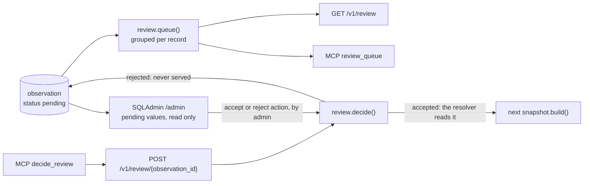

- `review.queue` returns the pending values grouped per source record, newest first
  (`review.py:23`). Each item has the record's failed checks (`food.flags`) and the values that the
  API serves now for its product (`resolve.products`).
- `review.decide` sets `status`, `reviewed_by`, `reviewed_at` and `review_note` in one update. The
  update matches only a `pending` row, so a value is decided once. A second decision gets a 409, and
  an unknown id gets a 404.
- An accepted value goes into the next snapshot build. It wins only if it is the newest accepted
  value of its record and field. Snapshots of earlier days do not change.
- A rejected value is never served. If the source sends the same value again, ingest sees no change
  and stores nothing, so the value does not come back for review.
- The REST routes are on one `APIRouter`, `review_router`, which needs the `review` scope
  (`api.py:110`). The split route `POST /v1/products/{id}/split` is on it too. The MCP tools `review_queue`, `decide_review` and `split_product` call the same handlers. Over
  HTTP, they need the `review` scope too (`api.py:152`). The SQLAdmin actions call `review.decide`
  with `by` set to the name of the admin key that logged in (`admin.py:54`).
- The SQLAdmin actions are GET requests, as SQLAdmin builds them. The login cookie is
  `SameSite=Strict` (`admin.py:90`). Thus a link on another site does not carry the session, and
  cannot decide a value.

### Match records into products

`match.run` loads every record with its newest accepted energy and macros (`match.py:25`). Splink
compares only candidate pairs (`match.py:110`). A pair has the same GTIN, or the same name words at
a similar energy, or the same brand and first word at a similar energy. Splink returns the pairs at
or above `FOODDB__BACKEND__MATCH_THRESHOLD` (default 0.95, `match.py:23`) with their match
probability (`match.py:152`).

`merges` joins products along these pairs, the strongest pair first (`match.py:160`). The records
of one product always stay together. A pair is skipped when it would put the two records of a
`cannot_link` row in one product. Thus a cluster that contains both sides of a constraint splits at
its weakest pairs, and each side keeps the pairs that are stronger.

In each joined group, the lowest product id survives. For each other product, `match.run` moves its
`food` rows to the survivor, sets `merged_into`, and writes one `merge_log` row in the same
transaction (`match.py:195`). The row holds the two products, the records that moved, the best
probability of a pair that joined the product, and the threshold. All rows of one run have the same
`at`. Matching never splits a product. Only a reviewer splits one (see [Split](#split-a-wrong-merge)).

The m and u probabilities are set by hand in `SETTINGS`. `fooddb match train` estimates them on the
current records (`match.py:214`). It estimates u by random sampling, and m by expectation
maximisation, blocked on the GTIN and then on the name words. It saves the Splink model as JSON to
`FOODDB__BACKEND__MATCH_MODEL` or `--out`. When that file exists, `match.run` uses it instead of
`SETTINGS` (`match.py:137`). The training runs in the CLI process, never in the worker parent.

### Split a wrong merge

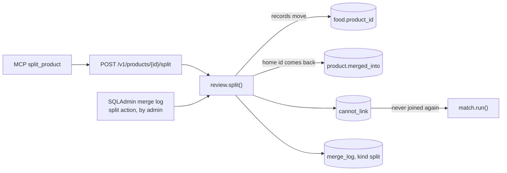

`review.split` moves the given records out of a product into one product of their own
(`review.py:81`):

1. The product must exist (else 404) and must not be merged away (else 409). The records must be
   records of the product, and at least one record must stay (else 422).
2. The home of a record is the product that ingest made for it. That is the `from_product` of its
   first `merge` row in `merge_log`.
3. When all records have one home, and that home now answers as this product, the home gets its id
   back. `merged_into` of the home becomes null. Products that were merged into the home now point
   at this product, because their records stay here. Thus old links to the home id work again.
4. Otherwise the records go to a new product. Merges from before `merge_log` existed have no rows,
   so their records always get a new product.
5. Each moved record and each record that stays become a `cannot_link` pair. A `split` row goes
   into `merge_log` with `by` and `note`.

`resolve.canonical` follows `merged_into`. Thus a restored id answers as itself at once. The
snapshot read collects values over the live `merged_into` links. After a split, the survivor's
values of a past day are what that day froze for it, because the build wrote them under its id. The
next build writes the values of both products for today. A pin on a past day for the restored id
has no values, because that day froze them under the survivor.

The SQLAdmin view `merge-log` lists `merge_log`. Its split action splits the records of a `merge`
row out of the product that the row's survivor answers as now (`admin.py:63`).

### Resolve

The resolver picks one value per product and nutrient (`resolve.py:24`):

1. Per source record, it takes the newest accepted observation of each nutrient.
2. It drops the nulls. A withdrawn field thus falls back to the other records of the product.
3. Across records, `pick_sql` picks the winner (`resolve.py:24`). It compares the candidates in
   this order, and the first difference decides:
   1. **Recency.** A value that is older than the newest candidate by more than
      `FOODDB__BACKEND__STALE_AFTER_DAYS` (default 730) loses to the fresher ones. Thus a new OFF
      value wins over an FDC value from many years earlier.
   2. **Agreement.** The value that the most distinct sources agree with wins. Two values agree
      when they differ by 5 % or less, or by 0.5 or less in the unit of the nutrient
      (`resolve.py:20`). Two records of one source count as one source. Thus `fdc` and `off`
      that agree outvote a `label` value that is alone. Only values of one nutrient code are
      compared. A `CHOAVL` value is not a vote for or against a `CHOCDF` value.
   3. **Trust rank.** `brand`, then `label`, then `fdc`, then `off` (`resolve.py:17`).
   4. **Newest value**, then the smallest value, so that the result is always the same.

The live read, the snapshot build and the merge-follow of the snapshot read all use `pick_sql`.
Thus the rule has one definition. The rule applies to nutrient values only. The name, brand and
the other record fields come from the most trusted, newest record.

The `include=off` parameter adds the `off` layer to the query (`resolve.py:103`). Without it, OFF
values do not take part.

### Snapshot

`snapshot.build` writes the resolved values of all products for the current UTC day, in one
transaction (`snapshot.py:17`). It writes two scopes: `core` (core layer only) and `all` (core and
OFF). The build takes no day argument. It writes only today (`snapshot.py:13`).

A day is final when it is over. Until then, a second build on the same day replaces that day
(`snapshot.py:22`). The nightly build and the rebuild after a fetcher's first data both write
today. Thus a pin on today can change during the day, but a pin on an earlier day cannot. The build
deletes days that are more than 30 days older than the new day (`snapshot.py:34`).

The API reads values from the newest snapshot, or from the day that `?snapshot=` pins
(`resolve.py:133`). Before the first snapshot exists, the API resolves values live
(`resolve.py:137`). The snapshot holds only values. Record lists, names and merges always come from
the live tables (`resolve.py:127`). Each of these fields carries the record that it is read from,
so its licence tag is correct for the record that is served now.

`snapshot_value` is keyed by the product id at build time. A merge after the build moves records to
the survivor, but the old values stay under the merged-away id. Thus the snapshot read follows
`merged_into` backwards. It collects the values of each product and of every product merged into
it. It picks one value per nutrient with the same `pick_sql` rule (`resolve.py:68`). The
snapshot keeps only the winner of each old id. Thus agreement counts those winners, not every value
that the build saw. The result is the value that the build would have frozen if the merge had come
first. The index `product_merged_into_idx` keeps this lookup fast.

## Jobs and schedules

| Job | Function | Trigger | Priority |
|---|---|---|---|
| OFF deltas | `fetch_off_deltas` | every 6 h (`jobs.py:71`) | NORMAL |
| Snapshot | `build_snapshot` | cron `30 2 * * *`, UTC (`jobs.py:72`) | NORMAL |
| FDC Foundation, FDC SR Legacy | `fetch_fdc` | cron `0 3 * * 1`, UTC (`jobs.py:82`) | BATCH |
| Match | `match_products` | after a fetch that stored data (`jobs.py:57`) | NORMAL |
| First-boot FDC | `fetch_fdc` | once, when `fetcher_check` has no row (`jobs.py:76`) | NORMAL |
| First-boot snapshot | `build_snapshot` | once, when no snapshot exists (`jobs.py:79`) | BATCH |
| Snapshot rebuild | `build_snapshot` | after the first data of a fetcher, when no snapshot is newer (`jobs.py:64`) | BATCH |
| OFF full dump | `fetch_off_dump` | manual only (`cli.py:68`) | – |

pq evaluates cron in UTC (pq 0.8.1 `client.py:374`).

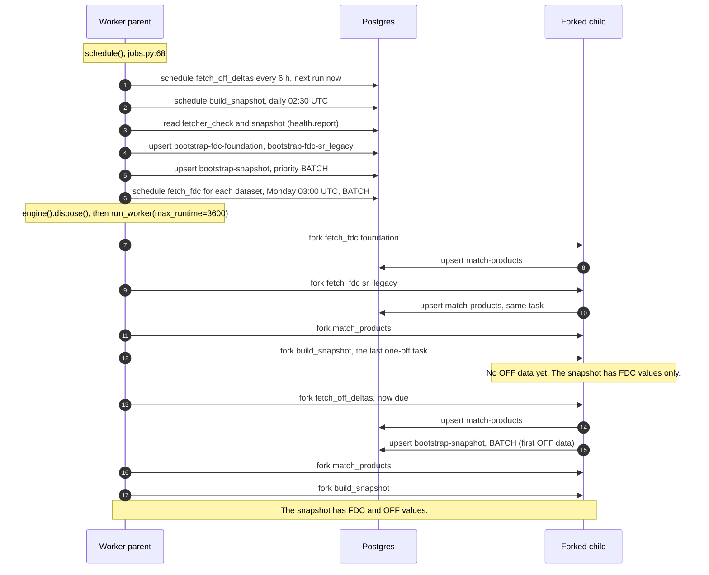

The worker parent registers the schedule, then forks one child per task (`cli.py:36`). It closes
its database pool before the first fork, so that no child inherits a connection (`cli.py:39`). The
match job imports Splink and DuckDB only in the child (`jobs.py:44`). Each task has a limit of one
hour (`cli.py:40`).

The pq worker takes one task at a time. It always takes a one-off task before a periodic task, and
a higher priority first (pq 0.8.1 `worker.py:722`, `worker.py:792`). This rule sets the first-boot
order above:

1. The two FDC tasks run first. Each one queues the match task. The client id `match-products`
   collapses the two requests into one task (`jobs.py:63`).
2. The match task runs before the snapshot, because BATCH is the lowest priority.
3. The first snapshot runs next. It is the last one-off task.
4. Only then does the periodic OFF delta task run, although it was due at once.
5. The OFF delta queues the match task and a snapshot rebuild. The match task runs first, then the
   snapshot. Now the snapshot has OFF values.

A fetch that stores data queues a snapshot rebuild if no snapshot is newer than the first
successful run of that fetcher (`jobs.py:64`, `snapshot.py:34`). Thus the first data of each
fetcher gets into a snapshot without help. Later fetches wait for the nightly snapshot. The rebuild
uses the client id `bootstrap-snapshot`. Thus it collapses with the first-boot snapshot into one
pending task.

Each worker start registers the OFF schedule again with the next run set to now
(pq 0.8.1 `client.py:379`). Thus a restart of the worker always checks for OFF deltas at once.

The full OFF dump takes hours, which is more than the task limit. Run it with `fooddb run off-dump`
in its own container ([deploy.md](deploy.md#load-the-full-open-food-facts-dump)). It loads a dump
only once per `Last-Modified` value of the file (`fetchers/off.py:195`).

## Database schema

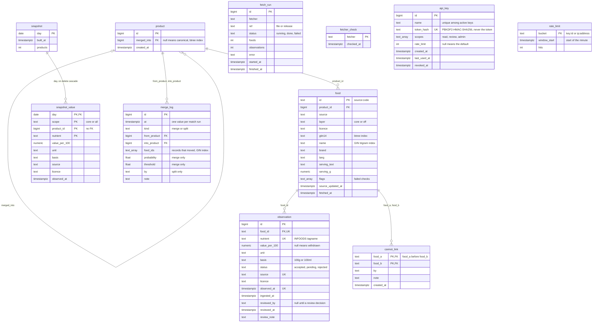

Seven Alembic migrations make this schema:

- `0001` enables `pg_trgm` and creates `food`, `observation` and `fetch_run`
  (`alembic/versions/0001_initial_schema.py:16`). Its `food_value` view was the first resolver.
- `0002` adds `product` and `food.product_id`. It adds `basis`, `status` and `licence` to
  `observation`, with check constraints on `status` and `basis`. It makes `value_per_100`
  nullable and drops the `food_value` view (`alembic/versions/0002_products_and_value_status.py:14`).
- `0003` adds `snapshot` and `snapshot_value` (`alembic/versions/0003_snapshots.py:14`).
- `0004` adds `fetcher_check` (`alembic/versions/0004_fetcher_check.py:14`).
- `0005` indexes `product.merged_into` (`alembic/versions/0005_product_merged_into_idx.py:14`).
- `0006` adds `reviewed_by`, `reviewed_at` and `review_note` to `observation`, and the partial index
  `observation_pending_idx` on the pending rows for the review queue
  (`alembic/versions/0006_review_decisions.py:15`).
- `0007` adds `api_key` and the unlogged table `rate_limit` (`alembic/versions/0007_api_keys.py:16`).
  A crash can lose the counts of one minute, which is acceptable for a rate limit.
- `0008` adds `merge_log` and `cannot_link` (`alembic/versions/0008_merge_log_and_cannot_link.py:16`).

The unique constraint `observation_once` covers `food_id`, `nutrient`, `source` and `observed_at`.
The index `observation_latest_idx` serves the "newest per record and nutrient" queries.
`snapshot_value.product_id` has no foreign key. `fetch_run.fetcher` and `fetcher_check.fetcher`
use the same names as the health report (`health.py:11`), but no constraint links them. pq creates
its own tables, `pq_tasks` and `pq_periodic`, through `fooddb migrate` (`cli.py:22`).

## Request flow

### `GET /v1/products/{barcode}`

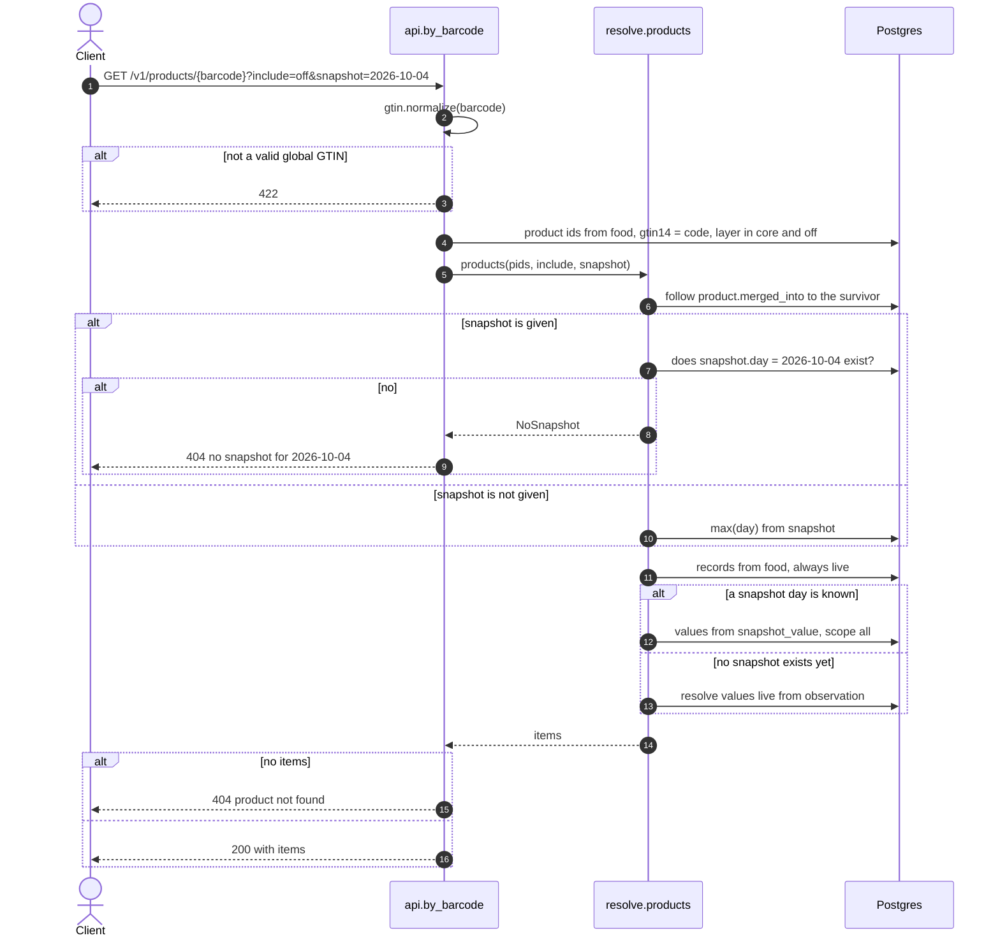

`by_barcode` (`api.py:77`) does these steps:

1. It normalises the barcode. An invalid or non-global GTIN gets 422 (`api.py:79`).
2. It finds the products that have a record with this GTIN in the visible layers (`api.py:82`).
   Without `include=off`, only the `core` layer is visible (`resolve.py:103`).
3. `resolve.products` follows `merged_into` to the survivor product (`resolve.py:107`). A
   merged-away id thus answers as its survivor, with the survivor's id.
4. With `?snapshot=`, it checks that the day exists. A day that does not exist gets 404
   (`resolve.py:134`, `api.py:23`). Without `?snapshot=`, it uses the newest day.
5. It reads the records of each product from the live `food` table (`resolve.py:136`). The most
   trusted, newest record gives the name, brand, language, serving and flags (`resolve.py:145`).
   Each barcode is tagged with the most trusted record that has it (`resolve.py:148`).
6. It reads the values from `snapshot_value` for the day and scope. The scope is `all` with
   `include=off`, else `core` (`resolve.py:131`). The values include those of every product merged
   into this one after the build (`resolve.py:68`). If no snapshot exists, it resolves live.
7. No visible product gets 404. Without `include=off`, the message suggests `include=off`
   (`api.py:85`).

The product shape (API version 0.3.0):

| Field | Shape |
|---|---|
| `id`, `snapshot` | fooddb's own: the product id, and the day that the values come from |
| `records` | the ids of the visible source records |
| `name`, `brand`, `lang`, `serving_text`, `serving_g`, `flags` | `{value, source, licence, record}`, or `null` when the naming record has no value (`resolve.py:96`) |
| `gtin14` | a list of `{value, source, licence, record}`, one per barcode |
| `per_100` | per nutrient: `{value, unit, basis, source, licence, observed_at}` (`resolve.py:149`) |

Without `include=off`, only `core` records are read. Thus no field of a core response comes from
the OFF layer, and no ODbL tag is in it.

The other read endpoints use the same `resolve.products` call:

- `GET /v1/foods?q=` searches `food.name` with `pg_trgm` word similarity (`api.py:49`).
- `GET /v1/foods/{product_id}` reads one product (`api.py:64`).
- `GET /v1/records/{record_id}` finds the product of one source record (`api.py:69`).

### `GET /v1/snapshots/{day}/export`

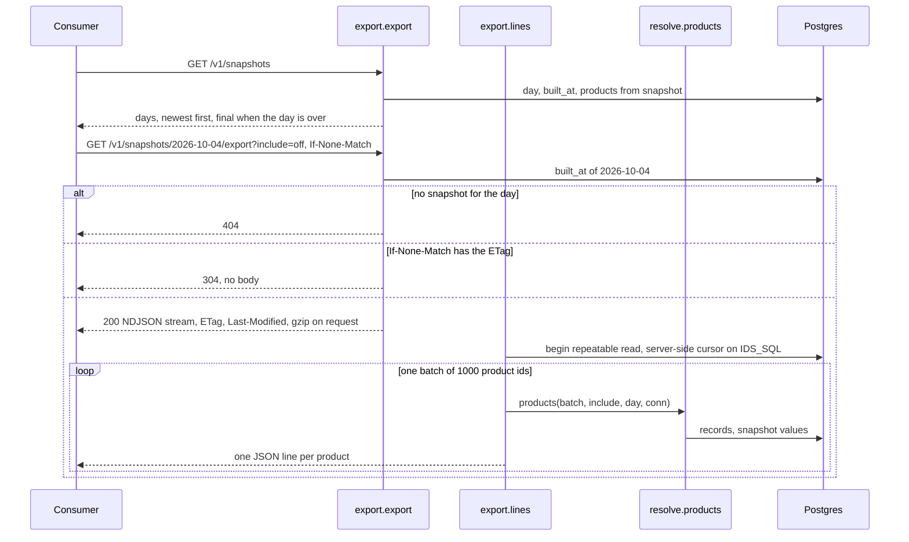

The export router is in `export.py`. The app adds it with `include_router` and the `read`
dependency (`api.py:31`). See [Authentication](#authentication).

- `GET /v1/snapshots` lists the days, newest first (`export.py:34`). `final` is true when the day
  is before today (UTC). `products` counts the products with values in the `all` scope at build
  time, before later merges.
- `GET /v1/snapshots/{day}/export` gets 404 for a day with no snapshot (`export.py:81`). The ETag
  is weak and is made of the day, the scope and `built_at`. A final day is never rebuilt, so its
  ETag never changes. A matching `If-None-Match` gets 304 (`export.py:87`).
- `export.lines` reads in one repeatable-read transaction (`export.py:50`). A rebuild or a merge
  during the export does not change what it sends.
- `IDS_SQL` selects every product with values that day, and follows `merged_into` to the survivor
  (`export.py:23`). A server-side cursor fetches the ids in batches of `BATCH` (1000)
  (`export.py:53`). Each batch goes through `resolve.products`, so each line has the shape of
  `GET /v1/foods/{id}?snapshot=`. The process never holds the full export in memory.
- With `gzip` in `Accept-Encoding`, `export.gzipped` compresses the stream (`export.py:90`).
- `fooddb export --day --include-off --out` writes the same lines to a file, gzipped when the name
  ends in `.gz` (`cli.py:107`).

### `/livez` and `/healthz`

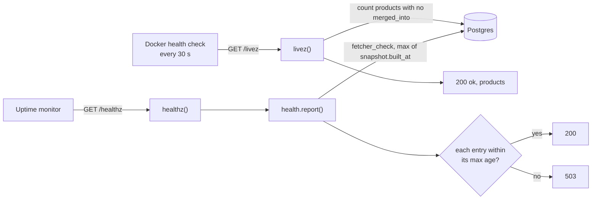

- `/livez` shows that the process is up and can query the database (`api.py:34`). It says
  nothing about the age of the data. A database error gives a 500, not a 200.
- `/healthz` shows freshness (`api.py:42`). It compares each `fetcher_check` row and the newest
  `snapshot.built_at` with a maximum age (`health.py:11`): `off-delta` 12 h, `fdc-foundation` and
  `fdc-sr_legacy` 8 days, and `snapshot` 26 h. One stale entry or one entry with no row gives 503.
- A fetch that finds nothing new also counts as a successful check (`health.py:19`,
  `jobs.py:21`, `jobs.py:37`). The full OFF dump has no health entry.

### MCP

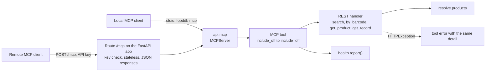

The MCP server is `mcp` in `api.py`. It uses the official MCP Python SDK (`MCPServer`). Each tool
calls the REST handler for the same read, so MCP and REST cannot answer differently:

| Tool | Calls | REST equivalent |
|---|---|---|
| `search_foods` | `search` | `GET /v1/foods?q=` |
| `get_product_by_barcode` | `by_barcode` | `GET /v1/products/{barcode}` |
| `get_food` | `get_product` | `GET /v1/foods/{product_id}` |
| `get_record_product` | `get_record` | `GET /v1/records/{record_id}` |
| `health_report` | `health.report` | `GET /healthz` |
| `review_queue` | `review_queue` | `GET /v1/review` |
| `decide_review` | `decide_review` | `POST /v1/review/{observation_id}` |
| `split_product` | `split_product` | `POST /v1/products/{product_id}/split` |

- `include_off: true` becomes `include=off`. Without it, the tools return only the `core` layer.
  Each value keeps its `licence` tag, as in REST.
- `snapshot` pins a day, as `?snapshot=` does. `q` and `limit` have the same limits as REST.
- A 404, 409 or 422 from the handler becomes an MCP tool error with the same message.
- Over HTTP, the FastAPI lifespan runs the SDK's session manager. The route is stateless, so any
  API replica can answer any request.
- When `FOODDB__BACKEND__API_HOST` is `127.0.0.1` (the local default), the SDK refuses requests
  with a `Host` header other than localhost. In the image the value is `0.0.0.0`, so the check is
  off, and the reverse proxy sets the host.
- Over HTTP, every request to `/mcp` passes the same key check as a REST read (`api.py:214`). The
  review tools also need the `review` scope (`api.py:152`). Over stdio, no key is checked: the
  process is local and trusted. `decide_review` and `split_product` are its only writes. See [Review](#review).

### Authentication

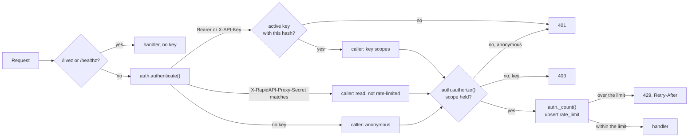

- A token is `fdb_` and 32 random bytes in URL-safe base64. `api_key` stores only its PBKDF2-HMAC-SHA256 under `FOODDB__BACKEND__SECRET_KEY`
  (`auth.py:43`). A lookup updates `last_used_at` in the same statement (`auth.py:66`).
- The scopes are `read`, `review` and `admin`. `review` implies `read`. `admin` implies both
  (`auth.py:15`).
- `auth.require(scope)` is a FastAPI dependency (`auth.py:131`). The data reads and the export
  router use `read` (`api.py:30`). `review_router` uses `review` (`api.py:110`).
- An anonymous caller passes a `read` check only when `FOODDB__BACKEND__REQUIRE_KEY_FOR_READS` is
  not `true` (`auth.py:99`). A key that is unknown or revoked gets 401, even on an open read.
- A request with `X-RapidAPI-Proxy-Secret` equal to `FOODDB__BACKEND__RAPIDAPI_PROXY_SECRET` gets
  the `read` scope. The compare is in constant time (`auth.py:93`).
- The rate limit is a fixed window of one minute. Each request does one upsert on `rate_limit`
  (`auth.py:110`). The bucket is the key, or the client IP for anonymous reads. The limit is the
  key's `rate_limit`, else `FOODDB__BACKEND__RATE_LIMIT_PER_MINUTE` (default 60). All API replicas
  share the counters.
- The client IP comes from `X-Forwarded-For` when the peer is in
  `FOODDB__BACKEND__FORWARDED_ALLOW_IPS` (`cli.py:52`). The compose stack trusts every peer, because
  it publishes the port on loopback only.
- `/admin` logs in with an `admin` key in the password field (`admin.py:63`). The session cookie
  holds the key id, signed with `FOODDB__BACKEND__SECRET_KEY`. Each admin request checks that the
  key is still active. Without the secret, `admin.mount` does not mount `/admin` (`admin.py:83`).

## Planned, not built

[design.md](design.md) and [decisions.md](decisions.md) describe these parts. The code does not
have them yet. Dashed boxes and dashed arrows are planned. Solid boxes exist today.

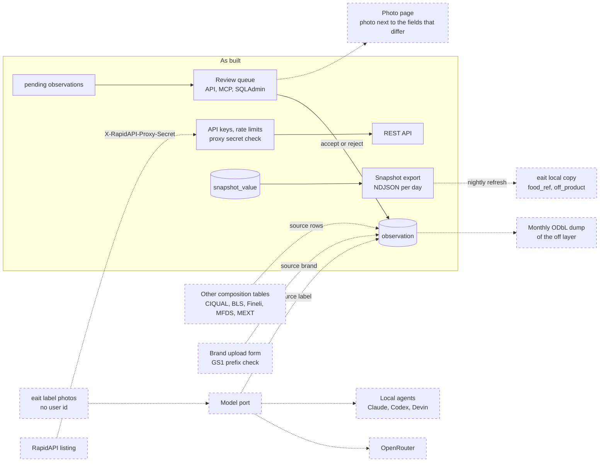

- **Intake.** Other national composition tables, the brand upload form with its GS1 prefix
  check, and label reads from eait photos. The resolver already ranks the sources `brand` and
  `label` above `fdc` (`resolve.py:17`), but no fetcher writes them.
- **Model port.** One port for all LLM work, with OpenRouter for the hosted pipeline and local
  agents for customers' own runs.
- **Review photo page.** A page that shows the label photo next to the fields that differ. It needs
  photo evidence on observations ([#12](https://github.com/eait-fit/fooddb/issues/12)).
- **Checks.** Ranges per category, and front-of-pack warning seals.
- **RapidAPI listing.** The listing itself, which sells the REST API. The API already accepts the
  listing's proxy secret as a `read` key. See [Authentication](#authentication).
- **eait as a consumer.** eait keeps a read-only local copy and refreshes it from the snapshot
  export. The export exists. The eait job that loads it does not.
- **ODbL dump.** A monthly ODbL dump of the OFF-derived layer.
